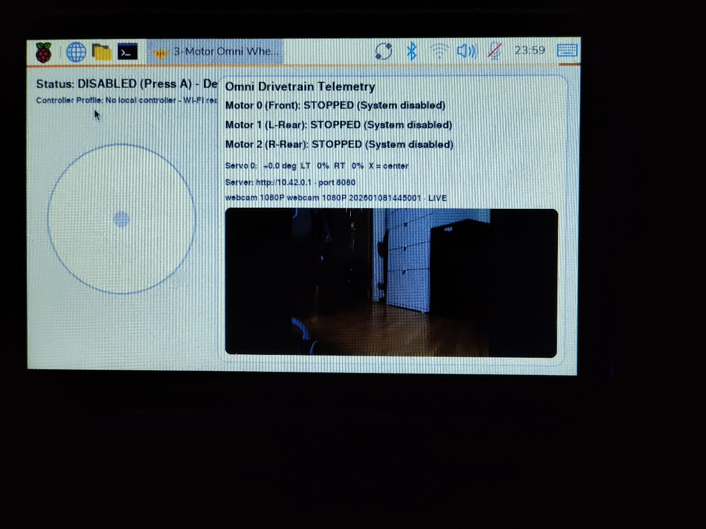
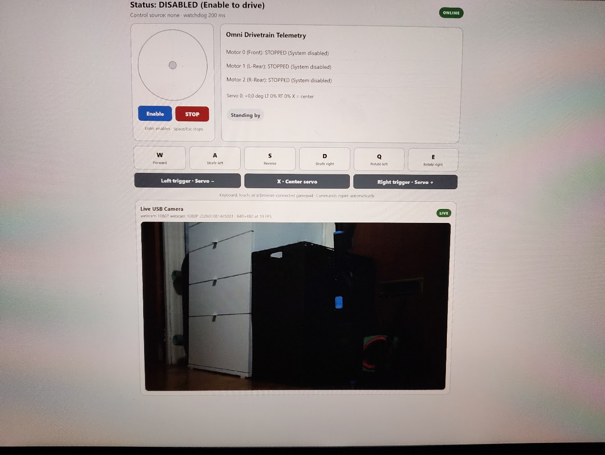

<div align="center">

# OmniBot

### A low-cost, 3D-printed omnidirectional robot

OmniBot is a Raspberry Pi 4 robot built for the City Tech AI & Automation Club. Using MSRP prices and the lowest-cost suitable Raspberry Pi 4, the parts come in under $100.

**[50% Speed Drive Test](https://youtube.com/shorts/8odiWHJd5yY)** | **[Motion Test](https://youtube.com/shorts/7Gmitm4C8bI)** | **[Servo & Camera Test](https://youtube.com/shorts/Lm-0vsGEmf4)** | **[CAD Files](#cad-files)** | **[Install](#install)**

</div>

---

<table>
  <tr>
    <td align="center" width="50%">
      <a href="images/Omni%20Bot%20CAD.png">
        
      </a><br>
      <strong>OmniBot CAD</strong>
    </td>
    <td align="center" width="50%">
      <a href="images/omnibot-assembled.jpg">
        
      </a><br>
      <strong>Assembled OmniBot</strong>
    </td>
  </tr>
</table>

## Overview

We wanted a cheap robot that students could build, understand, and change. OmniBot is a simple platform for learning:

- Omnidirectional drive code
- Motors and servos
- CAD and 3D printing
- Raspberry Pi programming
- Local image recognition

The three omni wheels let it move forward, backward, sideways, diagonally, and rotate. It can be driven with a Bluetooth controller or from the Wi-Fi dashboard on a phone or laptop.

The webcam supplies the live video and images used for vision. The goal is lightweight image recognition running locally on the Raspberry Pi, not an LLM. Image recognition is still being developed and is not included in the installer yet.

## Videos

| 50% Speed Drive Test | Motion Test | Servo & Camera Test |
| --- | --- | --- |
| [](https://youtube.com/shorts/8odiWHJd5yY) | [](https://youtube.com/shorts/7Gmitm4C8bI) | [](https://youtube.com/shorts/Lm-0vsGEmf4) |
| Forward drive followed by a left turn and left rotation, all at 50% speed | Three-wheel omni drive test | Servo movement with the USB webcam connected |

## 3D-Printed Build

Almost every structural part is 3D printed, including the chassis, mounts, wheel bodies, and wheel rollers. The motors, hubs, electronics, bearings, screws, and heat-set inserts are purchased parts.

The wheel bodies are rigid, while the rollers are TPU. The TPU gives the rollers some compliance and enough grip to drive. It can also slip slightly on rubber field tiles, which helps prevent too much rubber-on-rubber friction from loading the small motors.

The chassis prints in three sections and is joined by a piece on the bottom. This makes it easy to print, but it can flex slightly when lifted. Heat-set inserts make the robot easy to assemble and take apart.

## CAD Files

- [Fusion 360 archive (`Omni Bot.f3z`)](CAD%20Models/Omni%20Bot.f3z)
- [STEP assembly (`Omni Bot.step`)](CAD%20Models/Omni%20Bot.step)

This is the furthest version of the complete CAD. Some purchased parts, including the screen and webcam, did not have CAD files. We measured their outside dimensions and designed around them; we did not reverse engineer them. They may be simplified or missing from the assembly.

## Interface

<table>
  <tr>
    <td align="center" width="50%">
      <a href="images/onboard-interface.jpg">
        
      </a><br>
      <strong>Onboard Screen</strong>
    </td>
    <td align="center" width="50%">
      <a href="images/laptop-interface.jpg">
        
      </a><br>
      <strong>Laptop Dashboard</strong>
    </td>
  </tr>
</table>

The interface shows the webcam, motor output, servo position, and robot status. The web version supports keyboard, touch, and browser-gamepad controls.

## Install

Run this command on a Raspberry Pi with Raspberry Pi OS Desktop:

```bash
curl -fsSL https://raw.githubusercontent.com/AloeVeraZ/CityTechClubProjects/main/OmniBot/installer/curl-install.sh | bash
```

The installer pulls the project from GitHub and sets up the robot, servo, webcam, private Wi-Fi network, dashboard, and desktop auto-start. See the [installer guide](installer/README.md) for the full setup.

After rebooting:

1. Join Wi-Fi network `OmniBot` with password `omnibot1`.
2. Open `http://10.42.0.1`.
3. Select **Enable** and drive.

## Controls

| Input | Drive | Servo | Stop |
| --- | --- | --- | --- |
| Wi-Fi dashboard | `WASD` + `Q/E` | `[` / `]`, `X` to center | Space or Escape |
| Bluetooth controller | Left stick + right-stick rotation | Triggers, `X` to center | `Y` |

> [!CAUTION]
> Raise the robot so every wheel can spin during the first test. Do not power the motors from the Raspberry Pi 5 V rail.

## Repository Contents

```text
.
├── CAD Models/            # Fusion 360 and STEP files
├── images/                # README images
├── installer/             # Raspberry Pi installer
├── tests/                 # Hardware-independent tests
├── web/                   # Wi-Fi control interface
├── camera_stream.py       # USB webcam and MJPEG stream
├── omni_kinematics.py     # Three-wheel drive math
├── omni_robot.py          # Main robot program
├── servo_hat.py           # PCA9685 servo control
└── wifi_control.py        # Web controls and safety watchdog
```

---

Built through the **[City Tech AI & Automation Club](../)**.
