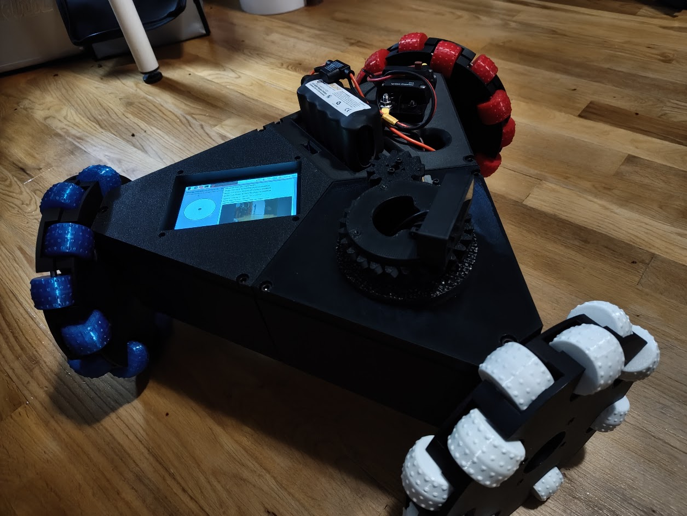

<div align="center">

# City Tech AI & Automation Club

### Learning how robots sense, move, react, and become more autonomous

[](#choose-a-project)
[](#how-the-projects-connect)
[](#project-comparison)
[](LICENSE.md)

<strong>Quick navigation:</strong><br>
[Overview](#overview) | [Choose a Project](#choose-a-project) | [Learning Path](#how-the-projects-connect) | [Comparison](#project-comparison) | [Repository Contents](#repository-contents)

</div>

[](https://www.instagram.com/p/DYOBZRNFmqn/?img_index=6)

---

## Overview

The **City Tech AI & Automation Club** gives students a place to build robots from the ground up and understand what every part is doing. The larger goal is to combine artificial intelligence with physical machines so robots can use sensors and cameras to recognize what is around them, make better decisions, and respond automatically.

The projects are organized as a learning path. The first two robots focus on the fundamentals: reading sensors, controlling different kinds of motors, connecting electronic modules, and improving a design through testing. The later projects combine those skills into larger systems with cameras, web interfaces, safety controls, and local computer-vision work.

## Choose a project

<table>
  <tr>
    <td width="50%" align="center" valign="top">
      <a href="self-balancing-robot/README.md"></a>
      <h3>01 · Self Balancing Robot</h3>
      <p>Learn sensor feedback, PID control, H-bridge motor drivers, and geared DC motors.</p>
      <p><a href="self-balancing-robot/README.md"><strong>Open project →</strong></a></p>
    </td>
    <td width="50%" align="center" valign="top">
      <a href="crab-crawler/README.md"></a>
      <h3>02 · Crab Crawler</h3>
      <p>Learn servo control, gait sequencing, ESP32 modules, wireless control, and camera streaming.</p>
      <p><a href="crab-crawler/README.md"><strong>Open project →</strong></a></p>
    </td>
  </tr>
  <tr>
    <td width="50%" align="center" valign="top">
      <a href="stem-research-academy/README.md"></a>
      <h3>03 · STEM Research Academy</h3>
      <p>Combine fabrication, custom electronics, mecanum drive, servos, a camera, Python, and a local web dashboard.</p>
      <p><a href="stem-research-academy/README.md"><strong>Open project →</strong></a></p>
    </td>
    <td width="50%" align="center" valign="top">
      <a href="OmniBot/README.md"></a>
      <h3>04 · OmniBot</h3>
      <p>Explore three-wheel holonomic control, Raspberry Pi software, live vision, and lightweight local image recognition.</p>
      <p><a href="OmniBot/README.md"><strong>Open project →</strong></a></p>
    </td>
  </tr>
</table>

## How the projects connect

The club starts with individual building blocks and adds complexity one layer at a time.

| Step | Project | Main lesson |
| --- | --- | --- |
| 01 | Self Balancing Robot | Read an IMU and use feedback to control two DC motors in real time. |
| 02 | Crab Crawler | Coordinate positional servos into a walking gait and add ESP32 camera and Wi-Fi modules. |
| 03 | STEM Research Academy | Integrate mechanics, power, wiring, motors, servos, video, networking, and Python into one complete robot. |
| 04 | OmniBot | Build a software-heavy robot that can move in any direction and use a camera for local vision and image-recognition development. |

The self-balancing robot and Crab Crawler are intentionally educational. One teaches continuous sensor feedback with **DC motors**; the other teaches timed motion with **servos**. Together they introduce the sensors, drivers, microcontrollers, power systems, and control logic needed before working on larger autonomous platforms.

## Project comparison

| Project | Motion | Main controller | Sensors and modules | Level |
| --- | --- | --- | --- | --- |
| Self Balancing Robot | 2 geared DC motors | Arduino Nano / Uno, Raspberry Pi Pico | MPU6050 IMU, H-bridge driver | Foundations |
| Crab Crawler | Servo-driven walking gait | Arduino Nano, ESP32-CAM | PCA9685 servo driver, camera, Wi-Fi | Foundations |
| STEM Research Academy | 4-wheel mecanum drive + ramp servos | Raspberry Pi 4 | USB camera, dual H-bridges, custom PCBs, hotspot, web dashboard | Full-system integration |
| OmniBot | 3-wheel holonomic drive + positional servo | Raspberry Pi 4 | USB webcam, PCA9685, Bluetooth, local web controls, vision pipeline | Advanced software / AI |

## Project videos

### Self Balancing Robot

| First prototype | Printed body | Pico controller |
| :---: | :---: | :---: |
| [](https://www.youtube.com/watch?v=-mdpzGmiDxs) | [](https://www.youtube.com/watch?v=whE-oMi1N7U) | [](https://www.youtube.com/watch?v=JzyDli07yCE) |

### Crab Crawler

| Arduino prototype | Small ESP32-CAM | Reinforced final version |
| :---: | :---: | :---: |
| [](https://www.youtube.com/watch?v=WJB2is0cYr0) | [](https://www.youtube.com/watch?v=dIKoLMmPl84) | [](https://www.youtube.com/watch?v=3YAVgb8yF3U) |

## Repository contents

Each project is self-contained. Its folder owns its README, code, CAD, images, installer, tests, and supporting documentation. That keeps projects from overlapping and makes it easy for another student to understand one robot or add a new project later.

```text
CityTechClubProjects/
|-- self-balancing-robot/   # IMU, PID, DC motors, CAD, and firmware
|-- crab-crawler/           # Servo walker and Fusion/STEP CAD
|-- stem-research-academy/  # 3TSahur server, installer, docs, tests, and images
|-- OmniBot/                # Holonomic drive, web control, camera, and vision work
|-- CITATION.cff
|-- LICENSE.md
`-- README.md
```

To add another club project, create a new top-level folder with its own `README.md` and keep all project-specific files inside it. Then add one new entry to this page.

## Links

- [Angelo Demetroulakos's portfolio](https://aloeveraz.github.io/)
- [Club project archive](https://angelojamesny.com/club-projects)
- [GitHub profile](https://github.com/AloeVeraZ)

## License

Project work in this repository is available under the [Creative Commons Attribution 4.0 International License](LICENSE.md). Third-party models and components remain under their original terms.

---

<div align="center">

Built through the **City Tech AI & Automation Club**.

</div>
