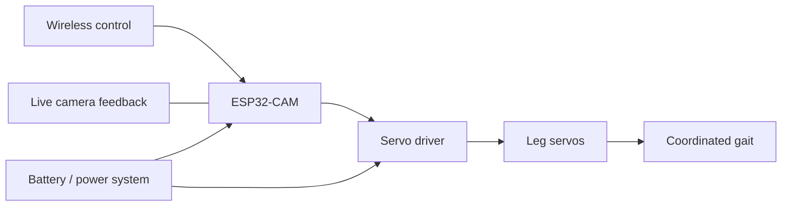

# Crab Crawler / Walking Robot

  
  
  
  

A compact four-leg walking robot developed through three mechanical and electronics revisions. The platform was created to teach ESP32 programming, sensor integration, servo breakout-board control, gait design, wireless control, and practical 3D-printed robotics.

## Project goals

- Build a low-cost walking robot using a small number of standard hobby servos.
- Use 3D-printed structures that can be revised quickly after physical testing.
- Simplify servo wiring through a dedicated driver board.
- Add ESP32-CAM wireless control and live video feedback.
- Create a platform that can be used to teach embedded programming and robotics.

## At a glance

| | |
|---|---|
| **Locomotion** | Four-leg, servo-driven walking gait |
| **Early controller** | Arduino Nano |
| **Later controller** | ESP32-CAM |
| **Servo control** | Dedicated servo driver/breakout board |
| **Structure** | Iterative 3D-printed frame |
| **Features explored** | Wireless control, live video, status feedback, gait synchronization |

## Design evolution

### Version 1 — Arduino Nano prototype

The first version used an Arduino Nano, a basic servo driver, a four-leg layout, and standard hobby servos. A physical toggle switch enabled and disabled the servos to make testing and debugging safer.

This build validated basic gait patterns and servo synchronization, but its oversized printed body and inefficient mechanical layout made it bulky. Poor torque distribution and structural stress also caused servos to strip under load. Those failures established the main requirements for a smaller, better-supported redesign.

### Version 2 — compact ESP32-CAM build

The second version moved to an ESP32-CAM and servo driver in a much slimmer frame. Wireless control and live video made the robot more capable while retaining the four-leg servo gait.

The aggressive size reduction introduced new problems: the frame was too weak and snapped under load, while crowded internal wiring reduced reliability. This version was valuable for testing compact packaging and wireless features, even though the mechanical design needed further reinforcement.

### Version 3 — reinforced final iteration

The third version retained the ESP32-CAM, servo driver, and four-leg gait while replacing the fragile structure with a thicker, reinforced printed frame. The stronger design improved load handling and motion consistency. Cleaner wiring also reduced connection problems and made the platform more reliable for continued testing.

## System layout

## CAD files

| Folder | Fusion archive | STEP export | Description |
|---|---|---|---|
| [`cad/final/`](cad/final/) | `final.f3z` | `final.step` | Final/reinforced walking robot design |
| [`cad/small/`](cad/small/) | `small.f3z` | `small.step` | Smaller compact design iteration |

See the [CAD notes](cad/README.md) for format and fabrication guidance.

## Results

- Produced stable walking motion with a compact servo-based design.
- Reduced the hardware count and overall project cost.
- Demonstrated wireless control and live visual feedback through the ESP32-CAM.
- Improved structural durability and wiring reliability through repeated physical revisions.
- Created a scalable educational platform for embedded programming, servo control, and gait development.

## Build considerations

The project history shows that smaller is not automatically stronger. Servo torque, linkage geometry, layer orientation, wall thickness, wire routing, and repeated impact loads all affect whether a printed walking frame survives.

Before fabrication:

1. Inspect the STEP geometry in your preferred CAD tool.
2. Confirm servo and board dimensions against the exact hardware you own.
3. Review print orientation and reinforce high-stress joints.
4. Check linkages for binding before powering the servos.
5. Test gait timing with the robot supported above the work surface.

> [!CAUTION]
> Servos can move unexpectedly and may draw high current when stalled. Keep fingers clear of the linkages, use an appropriately rated power supply, and disconnect power before changing mechanical parts or wiring.

## Links

- [Detailed walking robot page](https://angelojamesny.com/crabcrawler)
- [City Tech AI & Automation Club projects overview](https://angelojamesny.com/club-projects)
- [Repository home](../README.md)

## License

Original project materials are available under [CC BY 4.0](../LICENSE.md). You may copy, modify, redistribute, and use them commercially as long as you credit Angelo Demetroulakos, link to the license, and identify your changes.
