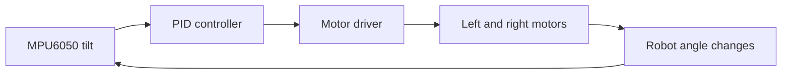

# Self Balancing Robot

### Three controller generations of sensor feedback, PID tuning, and mechanical iteration

     

This project is a two-wheel robot that moves its wheels under its center of
mass to remain upright. It was built as a practical way to learn inertial
sensing, feedback control, PID tuning, motor direction, and mechanical design.

[Project overview](#project-overview) · [Development path](#development-path) · [Open the CAD](cad/) · [Open the firmware](firmware/) · [Watch the videos](#build-videos)

---

## Project Overview

| System | Implementation |
| --- | --- |
| Control | PID balance loop |
| Sensor | MPU6050 inertial measurement unit |
| Controllers | Arduino Nano, Arduino Uno, and Raspberry Pi Pico |
| Drive | Two DC motors and a dual motor driver |
| Structure | Custom 3D-printed body with standard hardware |
| Repository | CAD exports, primary firmware, and preserved experiments |
| Status | Completed; earlier versions remain for comparison |

The same balance problem was tested with multiple controllers and mechanical
layouts. Keeping the earlier versions makes the project useful as a record of
how control behavior changed with hardware, loop timing, and PID values.

## Development Path

### 01 / First Prototype

The first build used an Elegoo car frame to prove that the MPU6050 readings,
motor direction, and balance correction worked together.

| Prototype | Purpose |
| --- | --- |
| Frame | Existing car chassis |
| Main test | Sensor-to-motor correction |
| Outcome | Established the first working balance loop |

---

### 02 / Printed Body

The second version moved to a smaller custom body. This build focused on
component placement, center of mass, wheel spacing, and more careful PID
tuning.

| Prototype | Purpose |
| --- | --- |
| Frame | Custom 3D-printed body |
| Main test | Mechanical layout and PID tuning |
| Outcome | More compact robot with smoother correction |

---

### 03 / Raspberry Pi Pico Controller

The final version used a Raspberry Pi Pico for faster, more consistent control
timing. Arduino Nano and Uno experiments remain in the repository as part of
the development record.

| Final version | Configuration |
| --- | --- |
| Controller | Raspberry Pi Pico |
| Sensor | MPU6050 |
| Drive | Two DC motors |
| Focus | Faster loop timing and smoother response |

## Control System

The MPU6050 measures the robot's tilt. The controller compares that measurement
with the target balance angle, calculates a PID correction, and commands the
motors in the direction needed to move the wheels under the robot.

## Project Files

### CAD Collection

The [`cad/`](cad/) folder includes editable Autodesk Fusion files and neutral
STEP exports for three mechanical versions.

| Design | Fusion file | STEP file |
| --- | --- | --- |
| Pico V1 | `cad/pico-v1/pico-cad-v1.f3z` | `cad/pico-v1/pico-cad-v1.step` |
| Arduino Uno V2 | `cad/arduino-uno-v2/arduino-uno-cad-v2.f3z` | `cad/arduino-uno-v2/arduino-uno-cad-v2.step` |
| Final reference | `cad/final-assembly/final-cad.f3d` | `cad/final-assembly/final-cad.step` |

[Open the CAD collection](cad/) · [Read the CAD guide](cad/README.md)

> [!WARNING]
> The final CAD assembly is a general reference, not an exact model of every
> purchased component. Measure the wheels, motors, batteries, boards, holes,
> and fasteners before printing parts.

### Firmware Collection

The [`firmware/`](firmware/) folder contains the main Arduino Nano and Pico
programs plus motor, IMU, and early PID experiments.

| Code area | Purpose |
| --- | --- |
| `arduino-nano/` | Main Nano balance controller |
| `raspberry-pi-pico/` | Main Pico balance controller |
| `experiments/motor-test/` | Motor direction test |
| `experiments/imu-serial/` | Sensor plotting and calibration |
| `experiments/pid-early/` | Early balance loop |
| `experiments/pid-alternate/` | Alternate PID implementation |

[Open the firmware collection](firmware/) · [Read the firmware guide](firmware/README.md)

## Build Videos

| First prototype | Printed body | Pico controller |
| --- | --- | --- |
|  |  |  |

## Upload and Test

1. Install the Arduino IDE and the board support for the selected controller.
2. Open the matching `.ino` file from `firmware/`.
3. Confirm the sensor, motor-driver, and motor pin assignments.
4. Keep both wheels raised for the first motor-direction test.
5. Keep the robot still during sensor calibration.
6. Begin with a low motor-power limit.
7. Tune the target angle and PID values for the physical build.

## Results

- The robot balanced and moved using MPU6050 feedback.
- The same control idea was tested across Arduino and Pico hardware.
- Mechanical changes and PID tuning improved the final response.
- Earlier code and CAD versions preserve the development process.

## Safety

> [!CAUTION]
> The robot can move quickly or fall without warning. Keep fingers away from
> the wheels, use a clear test area, and disconnect motor power before changing
> wiring or mechanical parts.

---

[Project page](https://angelojamesny.com/selfbalancing) · [Club project collection](../README.md) · [City Tech AI & Automation Club](https://angelojamesny.com/club-projects)

Original project work is available under [CC BY 4.0](../LICENSE.md). Third-party
parts and models remain subject to their original terms.
