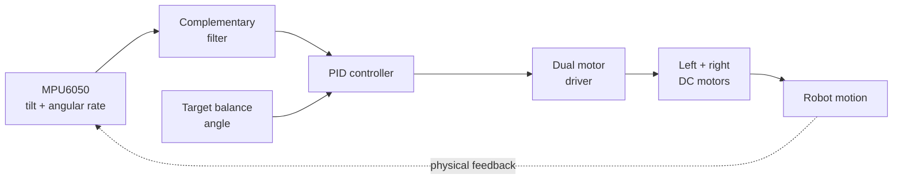

<p align="center">
  <a href="https://angelojamesny.com/selfbalancing"></a>
  
  
  <a href="../LICENSE.md"></a>
</p>

# Self-Balancing Robot

A two-wheel robotics platform that uses real-time inertial feedback and PID control to stay upright. The project was developed as both a working robot and a hands-on way to teach control theory: changing the proportional, integral, and derivative values makes responsiveness, overshoot, oscillation, and recovery visible in real time.

The designs reuse readily available school and off-the-shelf components, keeping the platform practical, affordable, and easy to iterate.

## At a glance

| | |
|---|---|
| **Control loop** | Closed-loop PID balance correction |
| **Orientation** | MPU6050 accelerometer + gyroscope with complementary filtering |
| **Controllers represented here** | Arduino Nano, Arduino Uno, and Raspberry Pi Pico |
| **Drive system** | Dual DC motors through an H-bridge motor driver |
| **Mechanical design** | Custom 3D-printed chassis plus off-the-shelf hardware |
| **Project status** | Finished; firmware includes the development history |

## Demonstrations

<table>
  <tr>
    <td align="center"><a href="https://www.youtube.com/watch?v=-mdpzGmiDxs"><br><strong>Version 1</strong></a></td>
    <td align="center"><a href="https://www.youtube.com/watch?v=whE-oMi1N7U"><br><strong>Version 2</strong></a></td>
    <td align="center"><a href="https://www.youtube.com/watch?v=JzyDli07yCE"><br><strong>Version 3</strong></a></td>
  </tr>
</table>

## How it works



The IMU measures acceleration and angular velocity. A complementary filter combines those readings into a stable pitch estimate. The controller compares that estimate with the target balance angle, calculates a corrective motor command, and drives both wheels in the direction needed to move the contact point back under the robot.

## Project evolution

- **Version 1 — rapid prototype:** reused an Elegoo smart-car platform to validate the balancing algorithm and learn how motor precision, frame rigidity, and center of gravity affect stability.
- **Version 2 — custom printed chassis:** moved to a compact microcontroller-based design with custom structural parts, an MPU6050, a motor driver, and two DC motors. This phase focused on PID tuning and mechanical layout.
- **Version 3 — faster control:** introduced Raspberry Pi Pico control for quicker processing and smoother correction, reducing oscillation and improving recovery consistency.

The repository also includes Arduino Nano and Arduino Uno work from the broader controller experiments. File labels are retained where possible so the hardware iterations can be traced without pretending every controller file maps one-to-one to the public version numbering.

## Repository map

```text
.
├── cad/
│   ├── arduino-uno-v2/     Fusion archive + STEP export
│   ├── final-assembly/     Final composite CAD reference
│   └── pico-v1/            Fusion archive + STEP export
├── firmware/
│   ├── arduino-nano/       Nano balancing controller
│   ├── raspberry-pi-pico/  Pico balancing controller
│   └── experiments/        Motor, IMU, and PID development sketches
├── assets/
├── CITATION.cff
└── LICENSE.md
```

See [the CAD guide](cad/README.md) before fabricating anything and [the firmware guide](firmware/README.md) before uploading a sketch.

## Important CAD accuracy note

> [!WARNING]
> The **Final CAD is a design reference, not a one-to-one digital twin of the physical robot**.

Several parts were bought off the shelf and are represented by simplified or approximate stand-ins. In particular, the wheel models, battery model, and the printed holder around one of the Arduino boards may be placeholders. Their geometry may not match the exact parts used in the finished build.

Before manufacturing or ordering parts:

1. Measure the actual hardware you plan to use.
2. Confirm hole spacing, wheel hubs, battery dimensions, board clearance, and fasteners.
3. Treat the final assembly as a layout and integration reference.
4. Adjust printable parts to match your specific components.

## Firmware quick start

1. Install the Arduino IDE.
2. Install the board core for your controller. The Pico sketch targets the Arduino Mbed OS RP2040 core.
3. Open the `.ino` file from its containing sketch folder.
4. Verify every pin assignment against your wiring before connecting motor power.
5. Keep the wheels off the ground for the first sensor and direction test.
6. Tune the target angle and PID gains for your physical robot; the checked-in values are starting points for the original builds, not universal constants.

> [!CAUTION]
> A balancing robot can accelerate suddenly. Use a current-limited supply during bring-up, secure loose wiring, keep fingers clear of the wheels, and verify the fall-angle motor cutoff before free-standing tests.

## Results

- Achieved stationary and directional balancing using real-time IMU feedback.
- Demonstrated the same control concepts across multiple embedded platforms.
- Improved recovery and reduced oscillation through repeated PID tuning.
- Reused available components to reduce cost and make the system useful as an educational robotics platform.

## Project links

- [Detailed self-balancing robot page](https://angelojamesny.com/selfbalancing)
- [City Tech club projects overview](https://angelojamesny.com/club-projects)
- [Repository home](../README.md)
- [Angelo's GitHub profile](https://github.com/TheTheAloe)

## License and attribution

Original project materials in this repository are licensed under the [Creative Commons Attribution 4.0 International License](../LICENSE.md). You may copy, modify, redistribute, and use them commercially, provided you credit **Angelo Demetroulakos**, link to the license, and indicate whether you made changes.

Suggested attribution:

> Self-Balancing Robot by Angelo Demetroulakos, licensed under CC BY 4.0. Source: https://github.com/AloeVeraZ/CityTechClubProjects

Third-party and off-the-shelf component models remain subject to their original owners' rights and are not relicensed beyond the permissions Angelo has authority to grant.
