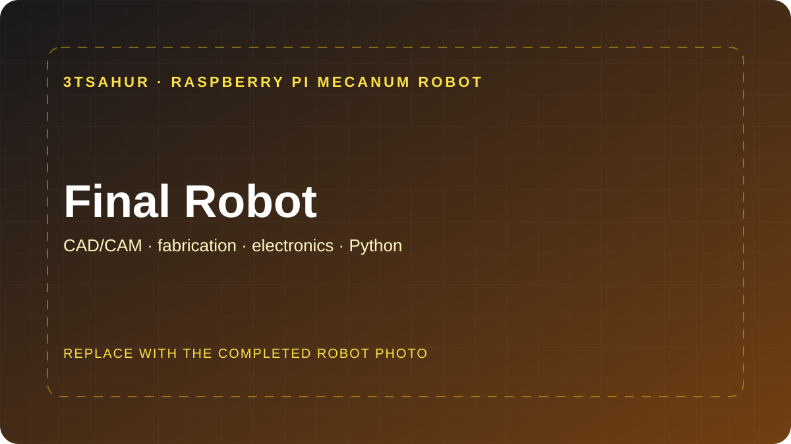
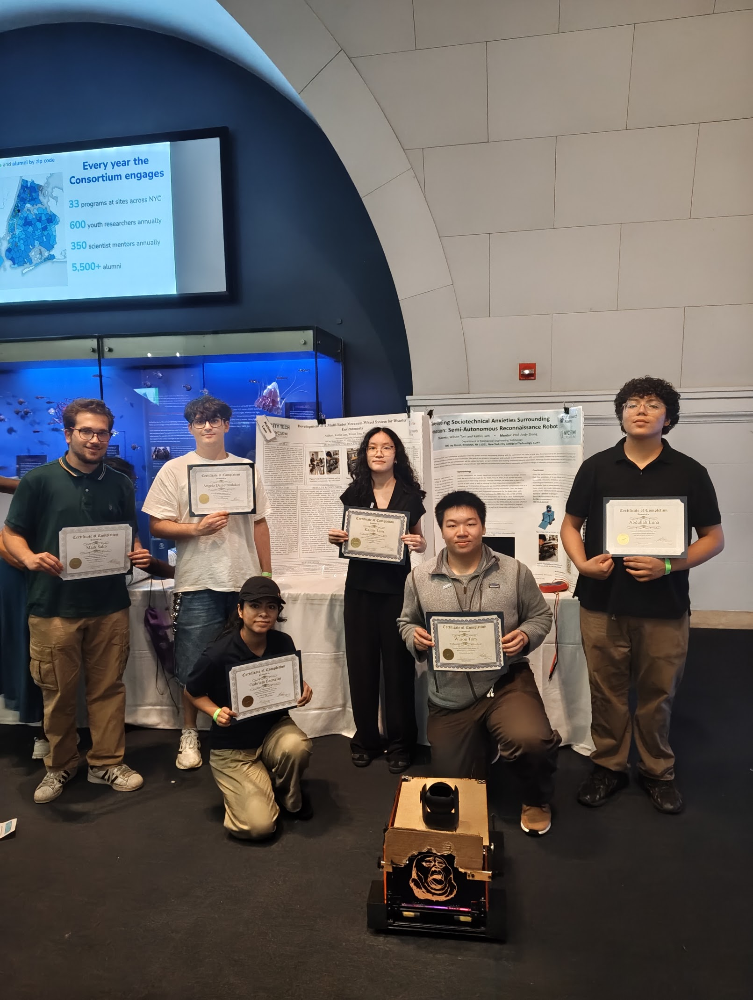
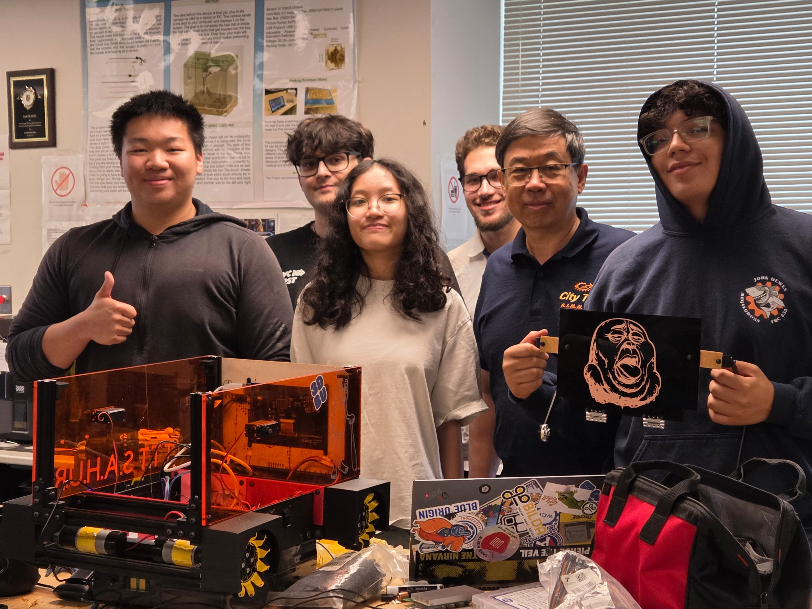
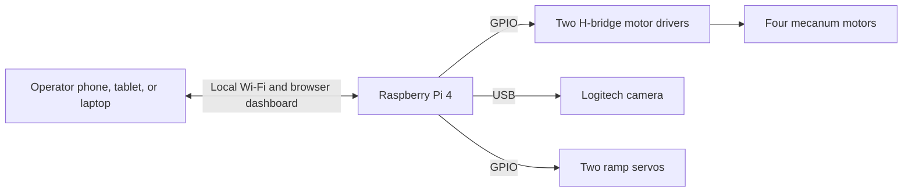

# STEM Research Academy Robot Lab

### Six weeks of CAD/CAM, fabrication, electronics, and robot integration

[](#program-overview)
[](#team-and-learning)
[](#large-robot-system)
[](robot_server/)
[](../LICENSE.md)

This folder documents the large **3TSahur** mecanum robot built during the
STEM Research Academy. The project brought two students and four mentors
through the complete path from an idea to a working machine.

[Meet the team](#team-and-learning) · [Explore the system](#large-robot-system) · [Connect to the robot](#connect-and-drive) · [Open the code](robot_server/) · [View the documentation](docs/)

---

## Program Overview

This was a six-week hands-on robotics program for **two students**, supported
by **four mentors**. The goal was not to assemble a kit. The students designed,
manufactured, wired, programmed, tested, and integrated a complete robot while
learning how the different engineering disciplines depend on one another.

| Program | Details |
| --- | --- |
| Students | 2 |
| Mentors | 4 |
| Duration | 6 weeks |
| Main build | Raspberry Pi 4 mecanum robot |
| Mechanical work | CAD/CAM, 3D printing, bandsaw and power-tool work, manual milling, CNC preparation |
| Electrical work | 5 V logic, 12 V power, custom PCBs, motor and servo electronics |
| Sensors and outputs | USB cameras, LiDAR-ready interfaces, LEDs, motors, and servos |
| Integration | Python control service and browser dashboard |

The program also produced two smaller Arduino-compatible robots using an
ESP32-S3 development module and an ESP32-S3 camera module. Each small robot
creates its own Wi-Fi network and uses a separate driving panel. Those builds
were completed locally and are not included in this repository.

> [!NOTE]
> Every remaining folder in `stem-research-academy/` belongs to the large
> Raspberry Pi robot. The smaller robots can be documented separately later.

## Team and Learning

[](images/README.md)

<table>
  <tr>
    <td width="50%" align="center" valign="top">
      
      <br><strong>Group Photo 01</strong><br>
      <sub>The team presenting its research and completed robot.</sub>
    </td>
    <td width="50%" align="center" valign="top">
      
      <br><strong>Group Photo 02</strong><br>
      <sub>The students and mentors with the robot in the lab.</sub>
    </td>
  </tr>
</table>

The build connected every part of the engineering workflow:

| Stage | What the students practiced |
| --- | --- |
| 01 / Design | Modeling robot parts, assemblies, fits, and manufacturing intent in CAD/CAM software |
| 02 / Prototype | Producing and revising parts with 3D printers |
| 03 / Manufacture | Working with hand tools, power tools, bandsaws, manual mills, and CNC-ready processes |
| 04 / Electrical | Building 5 V to 12 V systems, custom PCB connections, and an electronics stack |
| 05 / Integrate | Connecting motors, servos, cameras, LiDAR-ready sensors, LEDs, and power systems |
| 06 / Program | Bringing the hardware together with Python, a local network, and a browser dashboard |

---

## Large Robot System

3TSahur is a Raspberry Pi 4-based mecanum robot with four independently driven
wheels, a Logitech USB camera, and a two-servo ramp. The Pi hosts the dashboard,
motor-control API, health monitoring, and its own local Wi-Fi network. After
installation, normal operation does not require an internet connection.



| System | Implementation |
| --- | --- |
| Drive | Four-wheel mecanum movement: forward, reverse, strafe, and rotate |
| Interface | Local browser dashboard with keyboard, touch, mouse, and gamepad input |
| Camera | Automatic Logitech USB-camera discovery and MJPEG streaming |
| Ramp | Two synchronized servos with fixed open and closed positions |
| Safety | Expiring commands, sequence rejection, watchdog stop, focus-loss stop, and emergency stop |
| Deployment | Raspberry Pi hotspot, systemd service, local dashboard window, and mDNS |
| Monitoring | GPIO, camera, temperature, power, storage, and connectivity status |

## Repository Collection

### 01 / Robot Server

The [`robot_server/`](robot_server/) package contains the Python application
and the large robot's hardware-control layers.

| File area | Purpose |
| --- | --- |
| `app.py` | Dashboard API, current-command validation, and watchdog |
| `motor.py` | Mecanum mixing, motor polarity, and GPIO PWM output |
| `actuators.py` | Two-servo ramp control |
| `camera.py` | USB-camera discovery, recovery, and video streaming |
| `health.py` | Low-rate Raspberry Pi health monitoring |
| `static/` and `templates/` | Browser dashboard interface |

[Open the robot server](robot_server/) · [Read the server guide](robot_server/README.md)

---

### 02 / Raspberry Pi Installer

The [`installer/`](installer/) folder turns a Raspberry Pi OS installation
into the complete robot controller. It configures the Python environment,
GPIO services, hotspot, dashboard service, reverse proxy, mDNS name, and local
display window.

| Installer area | Purpose |
| --- | --- |
| `install.sh` | Full repeatable installation and update process |
| `hotspot.sh` | Local 2.4 GHz robot network |
| `kiosk.sh` | Resizable local dashboard window |
| `systemd/` | Dashboard, hotspot, and `pigpiod` services |

[Open the installer](installer/) · [Read the installer guide](installer/README.md)

---

### 03 / Wiring, Setup, and Tests

The documentation and test folders preserve the information needed to rebuild
and validate the large robot.

| Resource | What it covers |
| --- | --- |
| [`docs/WIRING.md`](docs/WIRING.md) | Motor-driver GPIO mapping, polarity, power, and servo wiring |
| [`docs/3TSAHUR_AUXILIARY_ACTUATORS.md`](docs/3TSAHUR_AUXILIARY_ACTUATORS.md) | Ramp positions, pulse settings, and mechanical checks |
| [`docs/SETUP.md`](docs/SETUP.md) | Pi installation and raised-wheel validation |
| [`tests/`](tests/) | Hardware-independent motor, servo, camera, API, health, and dashboard tests |

---

## Connect and Drive

After the installer completes and the Raspberry Pi reboots:

| Setting | Value |
| --- | --- |
| Wi-Fi name | `3TSahur-Swarm` |
| Wi-Fi password | `roboswarm1` |
| Raspberry Pi address | `10.42.0.1` |
| Dashboard | [http://10.42.0.1](http://10.42.0.1) |
| Direct service | [http://10.42.0.1:8080](http://10.42.0.1:8080) |
| mDNS, when supported | [http://3tsahur.local](http://3tsahur.local) |

1. Power on the robot and wait for the Pi to finish booting.
2. Join `3TSahur-Swarm` from the operator device.
3. Open `http://10.42.0.1`.
4. Test the stop controls before enabling motor power on the floor.

| Input | Action |
| --- | --- |
| `W` / `S` | Forward / reverse |
| `A` / `D` | Strafe left / right |
| `Q` / `E` | Rotate left / right at 75% |
| `R` | Open / close the ramp |
| `Space` | Stop the drivetrain |
| `Esc` | Emergency stop |

To open a terminal on the Pi:

```bash
ssh YOUR_PI_USERNAME@10.42.0.1
```

The installer does not create or change the Raspberry Pi OS login. Change the
default hotspot password before a public deployment.

## Hardware and Wiring

| Wheel | BCM GPIO pair |
| --- | --- |
| Front left | `5 / 6` |
| Rear left | `19 / 16` |
| Front right | `20 / 21` |
| Rear right | `26 / 13` |

The robot uses two dual-channel motor drivers, a fused external motor supply,
a physical power switch, a Logitech USB camera, and two ramp servos powered by
a separate regulated 5 V supply. The Pi and all motor/servo control electronics
must share a common ground.

Read the complete [wiring guide](docs/WIRING.md) before applying power.

## Install

Use a current Raspberry Pi OS image and run the installer as the normal Pi
user, not as root:

```bash
git clone https://github.com/AloeVeraZ/CityTechClubProjects.git
cd CityTechClubProjects/stem-research-academy
bash installer/install.sh
```

The installer deploys to `~/STEMResearchAcademy`, validates the service, and
reboots the Pi. See the [setup guide](docs/SETUP.md) for the full sequence.

## Local Development

The server falls back to simulation mode when Raspberry Pi hardware is not
available.

```bash
cd stem-research-academy
python -m venv .venv

# Linux or macOS
source .venv/bin/activate

# Windows PowerShell
# .venv\Scripts\Activate.ps1

python -m pip install -r requirements.txt
python -m unittest discover -s tests -v
python run.py
```

Open [http://127.0.0.1:8080](http://127.0.0.1:8080) for the simulated dashboard.

## Safety

> [!CAUTION]
> Raise all four wheels for the first powered test. Disconnect motor power
> before wiring or servicing the robot. Software stop controls are not a
> replacement for a physical motor-power switch.

- Keep motor and servo power separate from Raspberry Pi logic power.
- Connect every required common ground before applying power.
- Use correctly rated drivers, wiring, battery, fuse, and power switch.
- Set the servo buck converter to 5.0 V before connecting the servos.
- Confirm every wheel direction at low speed before a floor test.
- Verify `Space`, `Esc`, key release, focus loss, and the watchdog.

---

Built through the City Tech AI & Automation Club's hands-on CAD-to-hardware
workflow. Return to the [club project collection](../README.md).
