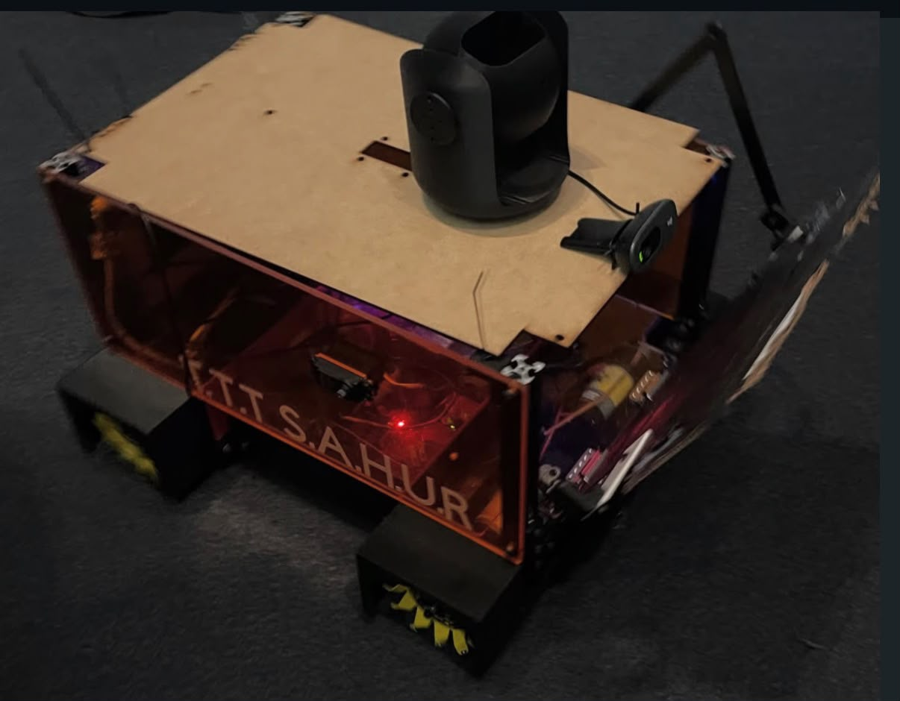

# STEM Research Academy Robot Lab

### Six weeks of CAD/CAM, fabrication, electronics, and full-system robot integration

<picture>
  
</picture>

Documentation and control architecture for the **3TSahur** mecanum robot built during a six-week hands-on engineering research program.

<strong>Quick navigation:</strong> 
[Meet the Team](#team-and-learning) | [System Architecture](#large-robot-system) | [Connect & Drive](#connect-and-drive) | [Robot Server](robot_server/) | [Installer](installer/) | [Back to Club](../)

---

## Program Overview

This was an intensive six-week robotics development program for **two high school students**, guided by **four collegiate mentors**. The project avoided pre-assembled commercial kits, guiding students through original CAD modeling, manual machining, custom PCB layout, embedded power electronics, and full-stack Python software development.

| Part | What we used |
| --- | --- |
| Student researchers | 2 |
| Technical mentors | 4 |
| Program duration | Six-week intensive |
| Robot platform | Custom 3TSahur Raspberry Pi 4 mecanum chassis |
| Mechanical fabrication | 3D printing, bandsaw shaping, manual milling, and CNC prep |
| Power & electronics | 5 V logic, 12 V fused power bus, custom PCBs, and buck regulation |
| Sensor & vision integration | Logitech USB camera, LiDAR-ready headers, and WS2812 status LEDs |
| Software architecture | Python Flask control daemon, local WebSockets, and HTML5 dashboard |

> [!NOTE]
> The program also produced two compact experimental robots utilizing ESP32-S3 and ESP32-CAM microcontrollers. Those prototypes operate on independent local networks and are documented in lab archives.

## Team and Learning

| Completed Robot | Research Presentation | Lab Build Session |
| :---: | :---: | :---: |
|  |  |  |

The program encompassed the complete product design cycle:

| Stage | Practical Skills Acquired |
| --- | --- |
| 01 / Design | Parametric component design, assembly clearances, and engineering drawing standards in CAD |
| 02 / Prototyping | Additive manufacturing tolerances, material selection (PLA/PETG), and rapid iteration |
| 03 / Fabrication | Safe operation of manual vertical mills, metal bandsaws, drill presses, and tapping tooling |
| 04 / Electrical | Soldering, heat-shrink harness routing, common grounding, and dual-rail power supplies |
| 05 / Integration | Interfacing H-bridge drivers, high-torque servos, USB video devices, and status LEDs |
| 06 / Software | Asynchronous Python services, Linux systemd daemons, local Wi-Fi routing, and responsive web UI |

## Large Robot System

3TSahur is driven by a Raspberry Pi 4 controlling four independent mecanum wheels, an automated two-servo ramp mechanism, and a Logitech HD camera stream. The Pi hosts its own standalone Wi-Fi hotspot, allowing operators to connect directly from any phone, tablet, or PC without internet access.

<table>
  <tr>
    <td align="center"><strong>Operator Browser UI</strong></td>
    <td align="center">&harr; Local Wi-Fi</td>
    <td align="center"><strong>Raspberry Pi 4</strong></td>
    <td align="center">&rarr; BCM GPIO PWM</td>
    <td align="center"><strong>Dual H-Bridge Drivers</strong></td>
    <td align="center">&rarr;</td>
    <td align="center"><strong>Four Mecanum Motors</strong></td>
  </tr>
  <tr>
    <td colspan="2"></td>
    <td align="center"><strong>Raspberry Pi 4</strong></td>
    <td align="center">&rarr; V4L2 USB</td>
    <td align="center"><strong>Logitech HD Camera</strong></td>
    <td colspan="2"></td>
  </tr>
  <tr>
    <td colspan="2"></td>
    <td align="center"><strong>Raspberry Pi 4</strong></td>
    <td align="center">&rarr; pigpio PWM</td>
    <td align="center"><strong>Dual Ramp Servos</strong></td>
    <td colspan="2"></td>
  </tr>
</table>

| Subsystem | Technical Specifications |
| --- | --- |
| Drivetrain | 4-wheel independent mecanum (holonomic: forward, strafe, rotate) |
| Local hotspot | Hostapd / NetworkManager 2.4 GHz network (`3TSahur-Swarm`) |
| Control protocol | Low-latency HTTP/JSON command streaming with heartbeat validation |
| Video streaming | Hardware-accelerated MJPEG video endpoint at `/video_feed` |
| Ramp mechanism | Mirrored 180° metal-gear servos powered via dedicated 5.0 V buck converter |
| Safety systems | Command auto-timeout, sequence rejection, focus-loss stop, and emergency killswitch |

## Repository Structure

### 01 / [Robot Server](robot_server/)

The [`robot_server/`](robot_server/) package contains the core Python service and hardware interface layers.

| Module | Technical Function |
| --- | --- |
| `app.py` | Flask API routing, watchdog timing, and command sequence verification |
| `motor.py` | Holonomic kinematics mixing, deadband filtering, and GPIO PWM output |
| `actuators.py` | Synchronized ramp servo positioning via `pigpiod` |
| `camera.py` | Dynamic USB camera discovery, frame capture, and MJPEG encoder |
| `health.py` | Real-time monitoring of CPU temp, voltage throttling, RAM, and storage |

[Browse the Robot Server](robot_server/) | [Read Server Guide](robot_server/README.md)

---

### 02 / [Raspberry Pi Installer](installer/)

The scripts in [`installer/`](installer/) turn a fresh Raspberry Pi OS install into the robot controller.

| Script / Service | Purpose |
| --- | --- |
| `install.sh` | Automated deployment script for dependencies, virtual environment, and systemd units |
| `hotspot.sh` | Creates standalone `3TSahur-Swarm` Wi-Fi access point (`10.42.0.1`) |
| `kiosk.sh` | Launches an optional fullscreen local dashboard window |
| `systemd/` | Production service definitions for auto-starting the server on boot |

[Browse the Installer](installer/) | [Read Installer Guide](installer/README.md)

---

### 03 / [Engineering Documentation & Tests](docs/)

| Resource | Scope & Contents |
| --- | --- |
| [`docs/WIRING.md`](docs/WIRING.md) | Complete schematic, BCM GPIO pin assignments, and power distribution map |
| [`docs/3TSAHUR_AUXILIARY_ACTUATORS.md`](docs/3TSAHUR_AUXILIARY_ACTUATORS.md) | Ramp servo geometry, pulse-width ranges, and travel limit calibration |
| [`docs/SETUP.md`](docs/SETUP.md) | Step-by-step bench commissioning and initial power-up verification |
| [`tests/`](tests/) | Hardware-agnostic unit tests covering kinematics, watchdog expiry, and API safety |

## Connect and Drive

After powering the robot and waiting for the Raspberry Pi to boot:

| Network / Service | Default Configuration |
| --- | --- |
| Wi-Fi SSID | `3TSahur-Swarm` |
| Wi-Fi Password | `roboswarm1` |
| Gateway IP | `10.42.0.1` |
| Dashboard Web Portal | [http://10.42.0.1](http://10.42.0.1) |
| Direct API Port | [http://10.42.0.1:8080](http://10.42.0.1:8080) |
| Local mDNS | [http://3tsahur.local](http://3tsahur.local) |

| Keyboard Key | Control Action |
| :---: | --- |
| `W` / `S` | Drive forward / backward |
| `A` / `D` | Strafe left / right |
| `Q` / `E` | Rotate counter-clockwise / clockwise (75% power) |
| `R` | Toggle ramp open / closed |
| `Space` | Immediate soft stop |
| `Esc` | Hardware emergency kill |

## Safety & Bench Testing

> [!CAUTION]
> Always prop the chassis up on a stand so all four mecanum wheels spin freely in the air during initial testing. Never apply battery power to motor drivers without a verified common ground.

- **Separate Power Rails:** Keep 12 V motor power completely isolated from the Raspberry Pi 5 V logic rail.
- **Buck Converter Verification:** Calibrate the servo buck converter to exactly 5.0 V with a multimeter before attaching servo leads.
- **Watchdog Validation:** Confirm that closing the browser or disconnecting Wi-Fi stops all motors within 500 ms.

---

Developed through the **City Tech AI & Automation Club** · **STEM Research Academy**

E.md).
