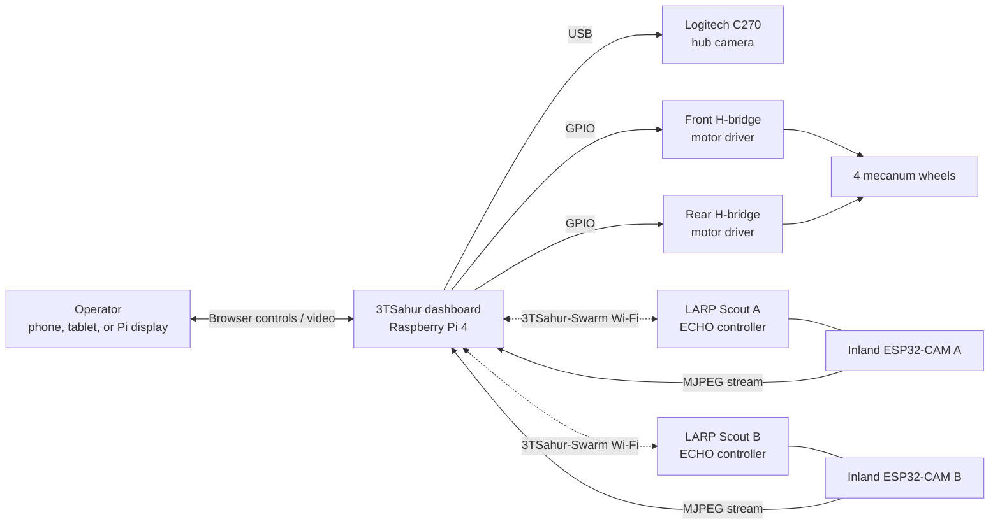
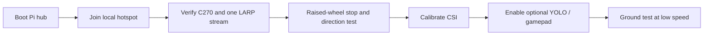
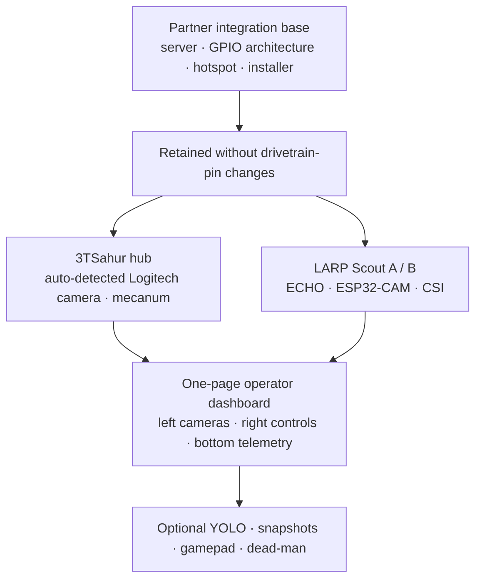
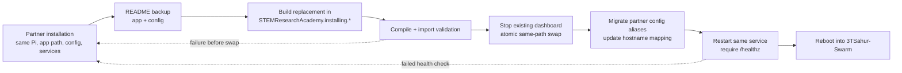

# 3TSahur + LARP Reconnaissance Swarm

<p align="center">
  
  
  
</p>

> One rugged Raspberry Pi mecanum hub, two mobile camera scouts, and one browser dashboard for safe local reconnaissance experiments.

## START HERE: connect your laptop to the robot

After the Raspberry Pi installer finishes and the Pi reboots, it creates its
own 2.4 GHz Wi-Fi network. Connect the laptop, phone, or tablet that will
control the robots with these exact values:

| What you need | Value | What it means |
| --- | --- | --- |
| **Wi-Fi name (SSID)** | **`3TSahur-Swarm`** | Select this network in the Wi-Fi menu on your laptop. This is the robot network, not a user-account name. |
| **Wi-Fi password** | **`roboswarm1`** | Enter this when the laptop asks for the `3TSahur-Swarm` network password. |
| **Pi IP address** | **`10.42.0.1`** | This is the Raspberry Pi's fixed address while connected to the robot Wi-Fi. |
| **Dashboard address** | **`http://10.42.0.1`** | Open this address in a web browser to view cameras and control the robots. |

1. Power on the Raspberry Pi and wait for it to finish booting.
2. On the operator laptop, open Wi-Fi settings and join **`3TSahur-Swarm`**
   with password **`roboswarm1`**.
3. Open **[http://10.42.0.1](http://10.42.0.1)** in the laptop's browser.
4. If that friendly dashboard address does not open, try the direct service
   address **[http://10.42.0.1:8080](http://10.42.0.1:8080)**.

To open a terminal on the actual Pi from the connected laptop, use:

```bash
ssh YOUR_PI_USERNAME@10.42.0.1
```

Replace `YOUR_PI_USERNAME` with the Raspberry Pi OS username that was chosen
when the SD card was created. The project does **not** set or change that login
username or its password. `http://3tsahur.local` is also available on devices
that support mDNS, but `10.42.0.1` is the dependable direct address.

> **Important:** These connection details work after the Pi installer has
> completed. The first installation still requires local access to the Pi and
> an internet connection. For a public or shared deployment, change the default
> hotspot password in the installer and all four scout firmware sketches before
> flashing them.

**3TSahur** is a Raspberry Pi 4 Model B (4 GB) mecanum-drive control hub with a Logitech C270 USB camera. It coordinates two ECHO differential-drive scout robots—**LARP Scout A** and **LARP Scout B**—each paired with an Inland ESP32-CAM video node. The project creates a self-contained local Wi-Fi control network: no internet connection is required during normal operation.

## What it can do

| System | Capability |
| --- | --- |
| 3TSahur hub | Drive forward, reverse, strafe, and rotate with four independently controlled mecanum wheels. |
| Live vision | Show the Logitech C270 feed plus two LARP ESP32-CAM MJPEG streams in one dashboard. |
| Scout control | Send direction commands to LARP Scout A and B independently over Wi-Fi. |
| Safety | Stop stale commands automatically; includes sequence checks, watchdogs, and a kill-all control. |
| Deployment | Configure a Pi hotspot, dashboard service, local touchscreen/display kiosk, and mDNS address. |
| Optional AI vision | Prepare pretrained YOLO11 Nano person detection for the selected C270 or LARP camera feed. |
| Efficient reconnaissance | Motion-gate person inference, recognize optional ArUco landmarks, and save JPEG-plus-telemetry evidence bundles. |
| Mission tools | Keep a bounded event timeline, monitor Pi health/camera recovery, save per-camera snapshots, calibrate LARP CSI baselines, and use browser gamepads/dead-man control. |
| Control protection | Yield analysis and auxiliary polling while moving; pause video automatically only if measured command latency degrades. |

## System overview



## Reproduction methodology

This project is designed as a local-first system: the Pi hosts the Wi-Fi
network, dashboard, motor control, C270 camera feed, and optional vision
worker. The two LARPs join that same network, register a heartbeat, receive
short-lived drive commands, and expose their own camera feeds. Nothing in
normal operation requires cloud access.

1. **Build safely.** Assemble and wire the parts in the rebuild checklist,
   leaving motor power disconnected until software checks pass.
2. **Install the Pi hub.** Flash Raspberry Pi OS, clone this repository, run
   the installer, and join the resulting `3TSahur-Swarm` hotspot.
3. **Validate one subsystem at a time.** Confirm the Pi dashboard, C270, each
   camera stream, each LARP heartbeat, then raised-wheel drive directions.
4. **Operate with control priority.** The one-page dashboard automatically
   keeps only the robot camera nearest the viewport open. Test `Space`/`Esc`
   before floor operation.
5. **Enable optional analysis last.** Use CSI calibration with the scene clear,
   then enable YOLO only for the selected camera when its performance is
   acceptable.

### What happens when the system runs

- The browser sends only current, expiring commands; stale/reordered input is
  rejected and the Pi watchdog stops 3TSahur if refreshes cease.
- Scrolling between robot workspaces closes inactive MJPEG streams and opens
  the camera nearest the viewport to protect control bandwidth.
- LARP drive status, CSI, timeline, health, vision, snapshots, and camera
  status are auxiliary features. Their failure must display a status only;
  it cannot disable the core stop/watchdog/control paths.
- The mission timeline is capped at 120 in-memory events. Snapshots are saved
  locally by the Pi; copy any images you need before rebooting or updating.

### Quick field-validation flow



For the next field session, use the step-by-step
[tomorrow checklist](docs/TOMORROW_CHECKLIST.md). It includes the ramp-servo
information needed for safe mechanical calibration.

## What changed from the partner integration base

The partner repository remains the software foundation. We retained the Python
server/package structure, motor-control pattern, hotspot installer, systemd
deployment, and original Pi mecanum GPIO mapping; the work here adapts and
extends that base for the 3TSahur/LARP swarm.

| Area | Partner-base behavior retained | 3TSahur/LARP changes |
| --- | --- | --- |
| Drivetrain | Python mecanum drive and GPIO architecture | Names changed only; exact BCM mapping remains `5/6`, `16/19`, `20/21`, `13/26`. |
| Deployment | Hotspot, service, kiosk, installer/update rollback | 3TSahur names, local operator workflow, beginner setup/checklists. |
| Dashboard | Responsive browser controls | Three visible robot workspaces, one scroll-selected stream, bottom health/timeline, gamepad/dead-man controls. |
| Scouts | ECHO drive/control foundations | LARP A/B identities, Wi-Fi recovery, heartbeats, CSI display/calibration, separate camera feeds. |
| Vision | No optional hub inference workflow | Per-feed YOLO11 Nano toggles, overlays, snapshots, and failure isolation. |
| Validation | Original functional test foundation | Expanded simulation coverage, API expiry/sequence checks, feature-isolation checks, and timing results. |



Read [docs/CHANGES_FROM_ORIGINAL.md](docs/CHANGES_FROM_ORIGINAL.md) for the
full file-level integration record.

### Current partner compatibility audit

This branch was re-audited against partner repository
`AloeVeraZ/CityTechClubProjects`, subdirectory `stem-research-academy`, at
commit `404c7e8`. The target audit started at `b16a505`. The comparison treats
the partner build as the source of truth for the already-tested Pi drivetrain,
control protocol, install locations, services, and ECHO motor interface; LARP
camera/mission features remain extensions.

| Compatibility surface | Partner baseline | Current 3TSahur/LARP result |
| --- | --- | --- |
| Pi model/runtime | Raspberry Pi OS, Python system packages, system-site venv | Same package strategy; adds nginx and optional isolated vision tooling. |
| Application/config paths | `~/STEMResearchAcademy`; `/etc/stem-research-academy/config.env` | Same paths; staged replacement uses the existing service rather than running a second app. |
| systemd services | `stem-robot-dashboard`, `stem-robot-hotspot` | Same unit names and executable paths; target replaces their definitions and health-checks port 8080. |
| Mecanum GPIO/PWM | BCM `5/6`, `16/19`, `20/21`, `13/26`; 1 kHz | Exact mapping/frequency retained; mixer and 15 ms shared reversal dead-time retained. |
| Browser/Pi safety | 300 ms command expiry, sequence rejection, 200 ms watchdog | Retained; unchanged PWM heartbeats are skipped without skipping watchdog refresh. |
| Scout API/discovery | `/drive`, `/stop`, `/status`, HTTP registration and UDP heartbeat | Endpoints and discovery payloads retained; timeout is reduced from 200 ms to configurable 120 ms. |
| Partner persistent keys | `SCOUT_A/B_HOST`, `ESP32_ONE/TWO_STREAM_URL` | Accepted at runtime and migrated into `LARP_A/B_HOST` and `LARP_A/B_CAMERA_URL` on install. |
| Network identity | `EchoSwarm`, `echoswarm`, `echo-scout-*` | Intentionally changes to `3TSahur-Swarm`, `3tsahur`, `larp-*`. |
| Pi hostname resolution | Partner installer changed hostname without updating `/etc/hosts` | Installer now backs up and updates only the `127.0.1.1` mapping while preserving unrelated aliases. |
| Cameras | C270 plus two configured network stream URLs | C270 retained with the one-active-stream policy. |



The software audit cannot validate motor polarity/current, H-bridge ratings,
actual ECHO motor IDs, camera-board variants, C270 USB power, or 2.4 GHz radio
conditions. After upgrading, perform the [raised-wheel and no-motion
checks](docs/TOMORROW_CHECKLIST.md) before a floor test.

### Verified compatibility with the partner baseline

The current project retains the partner team's tested mecanum GPIO mapping,
mixer, shared 15 ms reversal dead-time, latest-command-only control channel,
300 ms command expiry, and 200 ms Pi watchdog. The 3TSahur/LARP work adds tabs,
camera isolation, optional mission tools, and control-priority tuning around that
foundation; it does not replace the motor architecture. See the detailed
[partner baseline comparison](docs/PARTNER_BASELINE_COMPARISON.md) for every
retained behavior, added feature, latency difference, and test limitation.

## Dashboard

Open `http://10.42.0.1` after connecting to the 3TSahur hotspot. On a device that supports mDNS, `http://3tsahur.local` also works. The Pi's attached display opens the same dashboard automatically after installation.

```text
┌─────────────────────────────────────────────────────────────────────┐
│  [ 3TSahur ]  [ LARP Scout A ]  [ LARP Scout B ]     ● Online       │
├───────────────────────────────────┬─────────────────────────────────┤
│  Selected robot's live camera     │  Selected robot's controls      │
│  (one stream active at a time)    │  status, speed, and stop        │
├───────────────────────────────────┴─────────────────────────────────┤
│  Emergency STOP ALL · responsive phone/tablet/desktop layout         │
└─────────────────────────────────────────────────────────────────────┘
```

All three control workspaces remain on the page. The three selectors at the top
independently toggle camera feeds: one feed fills the camera wall, two divide it
evenly, and three use three stacked slots. Deselecting the last feed restores
3TSahur automatically, so the operator can never end up with an empty camera
wall. Opening multiple feeds uses more hotspot bandwidth; adaptive control
priority can still suspend them if measured command latency degrades.

### Current dashboard visual system

The UI uses a restrained dark control-room system inspired by the compact card
and segmented-navigation patterns catalogued on [21st.dev](https://21st.dev/).
The camera wall is always in the left column, while every camera-analysis,
speed, drive, CSI, ramp, and stop control stays visible in the right
column. Nothing floats over a camera or control panel.
System health, safety settings, and the mission timeline are a separate static
section at the end of the page.

```text
+-----------------------------------------------------------------------+
|  3TSAHUR-SWARM LOCAL COMMAND CENTER              [ LOCAL CONTROL ]   |
|  Reconnaissance dashboard     [ one camera ] [ watchdog protected ]  |
+-----------------------------------------------------------------------+
| [01 3TSahur]       [02 LARP Scout A]       [03 LARP Scout B]         |
+--------------------------------------+--------------------------------+
| 3TSahur camera                        | all 3TSahur controls            |
+--------------------------------------+--------------------------------+
| LARP A camera                         | all LARP A controls             |
+--------------------------------------+--------------------------------+
| LARP B camera                         | all LARP B controls             |
+--------------------------------------+--------------------------------+
| safety settings      system health       mission timeline             |
+-----------------------------------------------------------------------+
```

The dashboard presents one automatic USB-camera mode instead of three operator
quality choices. Linux V4L2 reports the attached model (for example, C270 or
C930), and the UI shows the detected name plus the resolution/FPS actually
negotiated by that camera. The redesign adds no packages, polling, simultaneous
video streams, model work, CSS filters, or motor-control changes.

The dashboard works with mouse/touch controls and the following keyboard shortcuts when the page is focused:

| Robot | Keys | Action |
| --- | --- | --- |
| 3TSahur | `W` / `S` | Forward / reverse |
| 3TSahur | `A` / `D` | Strafe left / right |
| 3TSahur | `Q` / `E` | Rotate left / right |
| 3TSahur | `Space` | Stop the hub drivetrain |
| LARP Scout A | Arrow keys | Forward, reverse, left, right |
| LARP Scout B | `I` / `K` / `J` / `L` | Forward, reverse, left, right |
| Selected 3TSahur/LARP camera | `C` | Toggle motion-gated person detection |
| Selected 3TSahur or LARP A camera | `L` | Toggle ArUco landmark recognition; use the button on LARP B because `L` steers it |
| All robots | `Esc` | Emergency kill-all |

Commands are deliberately short-lived. Releasing a key, losing the client connection, or letting the watchdog expire stops the affected robot.

## Hardware and wiring

### Rebuild checklist

**Required parts**

- [ ] Raspberry Pi 4 Model B (4 GB), microSD card, official-grade 5 V / 3 A supply, case/cooling, and a local display or operator phone/tablet.
- [ ] Logitech C270 USB webcam and four mecanum DC motors with compatible wheels/chassis.
- [ ] Two dual-channel H-bridge drivers, correctly rated fused motor battery/supply, wiring, common ground, and an accessible physical motor-power switch.
- [ ] For the ramp: two compatible servos, verified 5 V power capacity, and mechanical end-stop testing before movement is enabled.
- [ ] A 2.4 GHz Wi-Fi-capable operator device. A browser gamepad is optional; no Pi-side gamepad hardware is required.

**Raspberry Pi software checklist**

- [ ] Current 64-bit Raspberry Pi OS with internet available for initial installation.
- [ ] Run `bash installer/install.sh` as the normal Pi user. It installs Python, Flask, OpenCV, V4L2 tools, NetworkManager, Avahi, and required GPIO support.
- [ ] Optional YOLO: follow [docs/VISION_SETUP.md](docs/VISION_SETUP.md) to install the isolated persistent runtime and export `yolo11n_ncnn_model`.
- [ ] Optional landmarks: confirm the installed OpenCV build exposes `cv2.aruco`; the dashboard reports an isolated warning if it does not.

### 3TSahur hub

| Part | Role |
| --- | --- |
| Raspberry Pi 4 Model B (4 GB) | Runs the hotspot, web dashboard, control service, and USB camera feed. |
| Logitech C270 | USB hub camera. Use a powered USB hub if the Pi cannot supply enough current. |
| Two dual-channel H-bridge motor drivers | Drive the four mecanum motors. Motor power must come from a suitable external supply. |
| Four mecanum DC motors | Front-left, rear-left, front-right, rear-right wheel positions. |

The Pi GPIO layout below is intentionally the same layout as the integration base repository. GPIO numbers are **BCM numbers**, not physical header pin numbers.

| Wheel | Driver channel | GPIO direction pins |
| --- | --- | --- |
| Front left | Front driver IN1 / IN2 | GPIO 5 / GPIO 6 |
| Rear left | Front driver IN3 / IN4 | GPIO 16 / GPIO 19 |
| Front right | Rear driver IN1 / IN2 | GPIO 20 / GPIO 21 |
| Rear right | Rear driver IN3 / IN4 | GPIO 13 / GPIO 26 |

Do not power motors from the Pi's 5 V rail. Share a common ground between the Pi and motor-driver logic, verify each motor direction with wheels raised, and keep an accessible physical power switch. Full connection notes are in [docs/WIRING.md](docs/WIRING.md).

### Direct-GPIO two-servo ramp

The fixed camera has no movement controls. The 3TSahur dashboard exposes only
the ramp's two positions: **Closed** and **Open** (`R`). Servo 1 uses BCM GPIO
12 (physical pin 32), and Servo 2 uses BCM GPIO18 (physical pin 12). Both
initialize at 0 degrees when the service starts, move to 30 degrees when open,
and return to 0 degrees when closed. See the [direct servo pinout and safety
notes](docs/3TSAHUR_AUXILIARY_ACTUATORS.md).

## Install on the Raspberry Pi

### Fast install (recommended after review)

On a current Raspberry Pi OS image with internet access, run this as the
normal Pi user—not `root`. It downloads the repository's installer, which
then performs package installation, preflight validation, atomic app
replacement, hotspot/service setup, and reboot.

```bash
curl -fsSL https://raw.githubusercontent.com/AloeVeraZ/CityTechClubProjects/main/stem-research-academy/installer/curl-install.sh | bash
```

To install a reviewed non-default branch, download the bootstrap from that
branch and send the same branch name to **bash**:

```bash
branch=your-reviewed-branch
curl -fsSL "https://raw.githubusercontent.com/AloeVeraZ/CityTechClubProjects/${branch}/stem-research-academy/installer/curl-install.sh" | STEM_REPO_BRANCH="$branch" bash
```

The installer intentionally reboots. Read the script or use the clone method
below first if your team prefers to inspect every install step locally.

### Fix a Pi hostname warning before installing

If `sudo` prints `unable to resolve host ...: Name or service not known`, the
Pi's current hostname and `/etc/hosts` do not agree. This is a local Raspberry
Pi OS configuration warning, **not** a Git or GitHub conflict. A single warning
may still appear on the first `sudo` command below, before the repair takes
effect.

Run this block as the normal Pi user. It detects the Pi's actual hostname
(rather than assuming `3tsahur`), backs up `/etc/hosts`, writes the two required
local mappings, verifies them, and retries the package-index update:

```bash
set -Eeuo pipefail

if [ "$(id -u)" -eq 0 ]; then
    echo "Run this as the normal Pi user, not root." >&2
    exit 1
fi
if ! command -v sudo >/dev/null 2>&1; then
    echo "sudo is required but was not found." >&2
    exit 1
fi

pi_hostname="$(hostnamectl --static 2>/dev/null || true)"
if [ -z "$pi_hostname" ]; then
    pi_hostname="$(hostname 2>/dev/null || true)"
fi
if [ -z "$pi_hostname" ] || [ "${#pi_hostname}" -gt 253 ] || \
   ! printf '%s\n' "$pi_hostname" | grep -Eq '^[A-Za-z0-9]([A-Za-z0-9.-]*[A-Za-z0-9])?$'; then
    echo "Could not determine a safe current hostname; no files were changed." >&2
    exit 1
fi

hosts_backup="/etc/hosts.before-stem-install-$(date +%Y%m%d-%H%M%S)"
hosts_temp="$(mktemp)"
trap 'rm -f -- "$hosts_temp"' EXIT
printf '127.0.0.1\tlocalhost\n127.0.1.1\t%s\n' "$pi_hostname" > "$hosts_temp"

sudo cp --preserve=mode,ownership,timestamps -- /etc/hosts "$hosts_backup"
sudo install -o root -g root -m 0644 "$hosts_temp" /etc/hosts

getent hosts localhost
getent hosts "$pi_hostname"
echo "Hostname repair complete for: $pi_hostname"
echo "Backup saved at: $hosts_backup"

sudo apt-get update
```

This intentionally creates a minimal `/etc/hosts`; restore the timestamped
backup if the Pi previously depended on custom local aliases. If hostname
resolution succeeds but `apt-get update` reports a repository/source error,
that is a separate APT/network issue and must be diagnosed from its exact URL
and error message.

### Copy/paste Pi upgrade from the partner installation

If the Pi already runs the partner project or another dashboard build, **do
not reflash Raspberry Pi OS**. The 3TSahur installer replaces the installed
application and restarts the existing `stem-robot-dashboard` service. It uses
the same application path (`~/STEMResearchAcademy`) and configuration location
(`/etc/stem-research-academy/config.env`), so do not attempt to run both
dashboard versions at the same time.

Run this entire block as the normal Pi user. It creates timestamped backups
when the application or config exists, then installs the current integration
branch without performing a full Pi OS package upgrade:

```bash
set -Eeuo pipefail

upgrade_stamp="$(date +%Y%m%d-%H%M%S)"
app_backup="$HOME/STEMResearchAcademy.partner-backup-$upgrade_stamp"
config_backup="$HOME/stem-config.partner-backup-$upgrade_stamp.env"

if [ -d "$HOME/STEMResearchAcademy" ]; then
    cp -a -- "$HOME/STEMResearchAcademy" "$app_backup"
    echo "Application backup: $app_backup"
else
    echo "No existing ~/STEMResearchAcademy directory; skipping app backup."
fi

if sudo test -f /etc/stem-research-academy/config.env; then
    sudo cp -- /etc/stem-research-academy/config.env "$config_backup"
    sudo chown "$(id -u):$(id -g)" "$config_backup"
    echo "Configuration backup: $config_backup"
else
    echo "No existing config.env; skipping config backup."
fi

curl -fsSL https://raw.githubusercontent.com/AloeVeraZ/CityTechClubProjects/main/stem-research-academy/installer/curl-install.sh | STEM_SKIP_OS_UPGRADE=1 bash
```

No Raspberry Pi OS reflash is needed; the installer validates the replacement
and intentionally reboots the Pi when it finishes.

After the Pi reboots, expect these intentional changes:

- The hotspot is `3TSahur-Swarm` and the Pi hostname is `3tsahur`.
- The dashboard is at `http://10.42.0.1` after joining that hotspot.
- The retained mecanum GPIO layout and motor wiring stay the same.

Verify the service, then test 3TSahur with its wheels raised before connecting
or driving the LARPs:

```bash
sudo systemctl status stem-robot-dashboard --no-pager
sudo systemctl status stem-robot-hotspot --no-pager
```

If you need to return to the partner build after a successful upgrade, use the
backup above or rerun the partner repository's installer. See the [partner
baseline comparison](docs/PARTNER_BASELINE_COMPARISON.md) for the retained
motor architecture and the exact configuration differences.

### Optional one-command YOLO install

First install or update the base hub with the normal one-line installer above
and let the Pi reboot. This is required because older dashboard services cannot
start from the isolated vision runtime. Then run this separate command as the
normal Pi user (do **not** add `sudo`):

```bash
curl -fsSL https://raw.githubusercontent.com/AloeVeraZ/CityTechClubProjects/main/stem-research-academy/installer/install-vision.sh | bash
```

The command checks for 64-bit Raspberry Pi OS and 3 GB of free space, creates
`~/.local/share/stem-research-academy/vision/.vision-venv`, installs the
Ultralytics export dependencies and NCNN, downloads the COCO-pretrained
`yolo11n.pt`, exports a 320px `yolo11n_ncnn_model`, and runs a synthetic NCNN
inference before restarting the dashboard. It also writes the absolute runtime
and model paths to `/etc/stem-research-academy/config.env`, so both survive
normal application updates.

After it prints `dashboard health check passed`, open a robot tab and select
**Vision off** or press `C`. Start with one camera and keep the wheels raised
for the first test. Vision is lazy and motion-gated: when its toggle is off, no
model is loaded and no inference competes with robot control.

Verify the installation or collect the exact error with:

```bash
sudo systemctl status stem-robot-dashboard --no-pager
grep -E '^VISION_(VENV|MODEL)=' /etc/stem-research-academy/config.env
~/.local/share/stem-research-academy/vision/.vision-venv/bin/python - <<'PY'
import os
from ultralytics import YOLO

model_path = os.path.expanduser("~/.local/share/stem-research-academy/vision/yolo11n_ncnn_model")
YOLO(model_path)
print("YOLO11 Nano NCNN runtime is ready:", model_path)
PY
```

If the button reports **Vision unavailable**, run:

```bash
sudo journalctl -u stem-robot-dashboard -n 80 --no-pager
```

YOLO remains optional: do not install it until the base dashboard, cameras,
and controls have passed their physical checks. It is never required for motor
control or LARP operation.

### Manual vision install

Use this alternative if the repository is already installed locally and you
prefer to run the reviewed script from disk instead of piping it from GitHub.

- Current 64-bit Raspberry Pi OS; complete the base installation first.
- Stable power, at least 3 GB free storage, and temporary internet for the
  one-time package/model download and conversion.
- A connected C270 or a verified LARP ESP32-CAM MJPEG stream.
- Install as the normal Pi user in a separate environment—never as `root` and
  never into the dashboard's system Python packages.

```bash
cd ~/STEMResearchAcademy
bash installer/install-vision.sh
```

The complete [pretrained vision setup guide](docs/VISION_SETUP.md) includes
the C270 visual test, LARP feed prerequisites, safe performance settings,
offline-use notes, and a hardware validation checklist. Upstream references:
[YOLO11 models](https://docs.ultralytics.com/models/yolo11/),
[NCNN export](https://docs.ultralytics.com/integrations/ncnn/), and
[Raspberry Pi deployment](https://docs.ultralytics.com/guides/raspberry-pi/).

## Tests and simulation evidence

The hardware-independent test suite exercises simulated GPIO/PWM motor decisions, camera discovery, scout command proxy behavior, firmware settings, and installer invariants.

```bash
python -m venv .venv
# Linux/macOS
. .venv/bin/activate
# Windows PowerShell
# .venv\Scripts\Activate.ps1
pip install -r requirements.txt
python -m unittest discover -s tests -v
```

The current target desktop simulation ran **78 tests successfully**; the
independently checked partner baseline ran **32 tests successfully**. The target
suite covers dashboard/UI,
mecanum mixing, camera discovery/recovery/profile isolation, firmware invariants,
scout registry, Flask control APIs, mission events, snapshots, bounded evidence,
cached health telemetry, motion-gated vision, landmarks, and optional-feature
failure handling. Repeated held-command heartbeats are also verified to
refresh the watchdog without rewriting unchanged Pi or LARP motor outputs.
Hardware validation is still required for motor
polarity/current, Wi-Fi range, camera focus, CSI calibration, gamepad mapping,
and physical emergency-stop behavior. Read
[docs/SIMULATION_RESULTS.md](docs/SIMULATION_RESULTS.md) for the exact
results and limitations.

## Project structure

```text
stem-research-academy/
├── robot_server/                 # Python dashboard, GPIO drive, camera, scout proxy
│   ├── static/                   # Browser UI assets
│   ├── templates/                # Dashboard page
│   └── tests/                    # Software simulation tests
├── installer/                    # Pi installer, hotspot, systemd, kiosk setup
├── docs/                         # Wiring, setup, test report, integration changes
├── run.py                        # Dashboard entry point
└── requirements.txt              # Local development dependencies
```

## Local development

Run the dashboard without GPIO hardware for UI work and code review:

```bash
python -m venv .venv
. .venv/bin/activate
pip install -r requirements.txt
python run.py
```

Then browse to `http://127.0.0.1:8080`. On a non-Pi machine, GPIO behavior is simulated/fails safely; it does not move hardware. Keep real motor testing on the Pi, with wheels off the ground for the first run.

## Documentation

- [Setup guide](docs/SETUP.md) — end-to-end Pi, network, firmware, and first-drive procedure.
- [Tomorrow field checklist](docs/TOMORROW_CHECKLIST.md) — physical validation and ramp calibration data.
- [Field information checklist](docs/FIELD_INFORMATION_CHECKLIST.md) — exact photos, serial logs, network evidence, and hardware data needed for the next integration step.
- [Latency and connection tuning](docs/LATENCY_TUNING.md) — control-priority safeguards, reconnection behavior, and field-test sequence.
- [Wiring reference](docs/WIRING.md) — exact 3TSahur motor GPIO mapping and ESP32-CAM notes.
- [Simulation results](docs/SIMULATION_RESULTS.md) — commands run, passed tests, and test limitations.
- [Changes from original](docs/CHANGES_FROM_ORIGINAL.md) — what came from the integration base and what changed.
- [Installer guide](installer/README.md) and [server guide](robot_server/README.md) — package-specific operation details.

## Safety checklist

- Test each motion direction with the wheels clear of the floor.
- Use a fused motor supply sized for motor stall current; never run motor power through the Pi.
- Keep the motor battery disconnected while wiring or flashing boards.
- Make sure every controller shares the intended common logic ground.
- Test `Space`/`Esc` and a network-disconnect stop before operating near people or property.

---

Built from the partner project's deployment/dashboard foundation and adapted for the 3TSahur hub and LARP Scout system. See [docs/CHANGES_FROM_ORIGINAL.md](docs/CHANGES_FROM_ORIGINAL.md) for the complete integration record.
