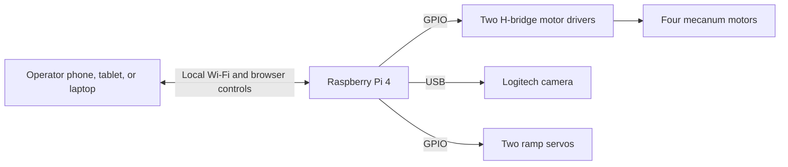

# STEM Research Academy Robot Project

<p align="center">
  
  
  
</p>

## About the program

This project was created for a six-week STEM Research Academy program serving
approximately 400 students. The goal was not simply to assemble a robot. The
students learned the full process of turning an idea into a working robotic
system: mechanical design, manufacturing, electronics, programming, testing,
and integration.

Students learned how to:

- design robot parts with CAD/CAM software;
- make parts with 3D printers, hand tools, power tools, and equipment such as
  bandsaws and manual milling machines;
- prepare designs for CNC manufacturing;
- build low-voltage electrical systems ranging from 5 V logic to 12 V power;
- assemble custom PCBs and electronic stacks for motors, servos, cameras,
  LiDAR, LEDs, and other sensors; and
- integrate the mechanical and electrical systems through Python code.

The program produced one large Raspberry Pi robot and two smaller
Arduino-compatible robots. The large robot is the project documented in this
directory. All remaining folders and files under `stem-research-academy/`
belong to that large robot.

The two small robots were built locally with an ESP32-S3 development module
and an ESP32-S3 camera module. Each small robot creates its own Wi-Fi network
and has its own driving panel. They were intentionally kept independent from
the Raspberry Pi robot because integrating all three systems was beyond the
available six-week schedule. Their source files are not included here; that
work can be documented separately later.

## The large robot

The large robot, named **3TSahur**, is a Raspberry Pi 4-based mecanum robot. It
hosts its own browser dashboard, drives four motors through two H-bridge motor
controllers, streams video from a Logitech USB camera, and controls two ramp
servos. The Raspberry Pi runs the Python control service and creates the local
Wi-Fi network used by the operator's laptop, phone, or tablet.

The software keeps control local. Normal operation does not require an internet
connection after installation.



## What the robot can do

| System | Capability |
| --- | --- |
| Mecanum drivetrain | Drive forward and backward, strafe left and right, and rotate using four independently controlled wheels. |
| Local dashboard | Provide touch, mouse, keyboard, and gamepad controls in a browser. |
| Live camera | Stream the attached Logitech USB camera to the dashboard. |
| Ramp | Move two servos together between fixed open and closed positions. |
| Safety controls | Reject expired or reordered commands, stop after a lost heartbeat, and provide normal and emergency stop controls. |
| Deployment | Configure the Raspberry Pi hotspot, dashboard service, local display window, and mDNS hostname. |
| Health monitoring | Report GPIO mode, camera status, temperature, power warnings, storage, and service connectivity. |

## Start here: connect to the robot

After the Raspberry Pi installer finishes and the Pi reboots, connect the
operator device with these values:

| Setting | Value |
| --- | --- |
| Wi-Fi name | `3TSahur-Swarm` |
| Wi-Fi password | `roboswarm1` |
| Raspberry Pi address | `10.42.0.1` |
| Dashboard | [http://10.42.0.1](http://10.42.0.1) |
| Direct dashboard port | [http://10.42.0.1:8080](http://10.42.0.1:8080) |
| mDNS address, when supported | [http://3tsahur.local](http://3tsahur.local) |

1. Power on the Raspberry Pi and wait for it to finish booting.
2. Join `3TSahur-Swarm` from the operator device.
3. Open `http://10.42.0.1` in a browser.
4. Test the stop controls before moving the robot.

To open a terminal on the Pi from the same network:

```bash
ssh YOUR_PI_USERNAME@10.42.0.1
```

The installer does not create or change the Raspberry Pi OS login. Replace
`YOUR_PI_USERNAME` with the account selected when the SD card was prepared.
Change the default hotspot password before a public deployment.

## Dashboard controls

| Input | Action |
| --- | --- |
| `W` / `S` | Drive forward / backward |
| `A` / `D` | Strafe left / right |
| `Q` / `E` | Rotate left / right at 75% |
| `R` | Open or close the ramp |
| `Space` | Stop the drivetrain |
| `Esc` | Emergency stop |

The drive speed slider controls translational movement. Releasing a movement
key, changing browser focus, or losing the command heartbeat stops the motors.
The server also rejects stale commands and uses a watchdog as a second layer of
protection.

## Hardware and wiring

### Main hardware

- Raspberry Pi 4 Model B with Raspberry Pi OS
- four mecanum motors and wheels
- two dual-channel DC motor drivers
- fused external motor supply and physical power switch
- Logitech USB camera
- two ramp servos with a separate regulated 5 V supply
- common electrical ground between the Pi and motor/servo control electronics

The drivetrain retains the established BCM GPIO mapping:

| Wheel | GPIO pair |
| --- | --- |
| Front left | `5 / 6` |
| Rear left | `19 / 16` |
| Front right | `20 / 21` |
| Rear right | `26 / 13` |

The complete polarity, motor-driver, servo-supply, and first-power-on details
are in [docs/WIRING.md](docs/WIRING.md). Ramp calibration and configuration are
in [docs/3TSAHUR_AUXILIARY_ACTUATORS.md](docs/3TSAHUR_AUXILIARY_ACTUATORS.md).

## Install on the Raspberry Pi

Use a current Raspberry Pi OS image and perform the first installation with an
internet connection. Run the installer as the normal Pi user, not as root:

```bash
git clone https://github.com/AloeVeraZ/CityTechClubProjects.git
cd CityTechClubProjects/stem-research-academy
bash installer/install.sh
```

The installer creates the Python environment, configures GPIO and `pigpiod`,
installs the systemd services, creates the hotspot, configures the local
dashboard window, validates the application, and reboots the Pi. It preserves
the existing mecanum pin mapping and installs into `~/STEMResearchAcademy`.

See [docs/SETUP.md](docs/SETUP.md) for the complete preparation and validation
sequence.

## Project structure

```text
stem-research-academy/
|-- robot_server/             Python server and large-robot hardware control
|   |-- app.py                Dashboard API, safety watchdog, and service entry
|   |-- motor.py              Mecanum mixing and GPIO motor outputs
|   |-- actuators.py          Two-servo ramp control
|   |-- camera.py             Logitech USB camera capture and MJPEG stream
|   |-- health.py             Low-rate Raspberry Pi health monitoring
|   |-- static/               Dashboard JavaScript and CSS
|   `-- templates/            Dashboard HTML
|-- installer/                Raspberry Pi installer and system services
|-- docs/                     Wiring, setup, and actuator documentation
|-- tests/                    Hardware-independent control and UI tests
|-- run.py                    Local entry point
`-- requirements.txt          Python application dependency list
```

## Local development and tests

The server falls back to simulation mode when Raspberry Pi GPIO libraries or
hardware are unavailable, so the control API can be tested on another computer.

```bash
cd stem-research-academy
python -m venv .venv

# Linux/macOS
source .venv/bin/activate

# Windows PowerShell
# .venv\Scripts\Activate.ps1

python -m pip install -r requirements.txt
python -m unittest discover -s tests -v
python run.py
```

Open [http://127.0.0.1:8080](http://127.0.0.1:8080). Motor and servo status
will show simulation or unavailable hardware when the required Raspberry Pi
interfaces are not present.

## Safety checklist

- Raise all four wheels before the first powered direction test.
- Keep motor and servo power separate from Raspberry Pi logic power.
- Connect the required common grounds before applying power.
- Use a correctly rated fuse, motor drivers, wiring, battery, and physical
  motor-power switch.
- Set the servo buck converter to 5.0 V before connecting the servos.
- Confirm each wheel direction at low speed before a floor test.
- Confirm `Space`, `Esc`, key release, focus loss, and the watchdog all stop the
  drivetrain.
- Never treat software stop controls as a replacement for disconnecting motor
  power while wiring or servicing the robot.
