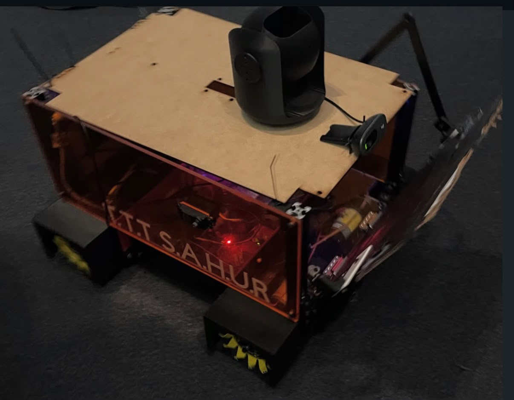
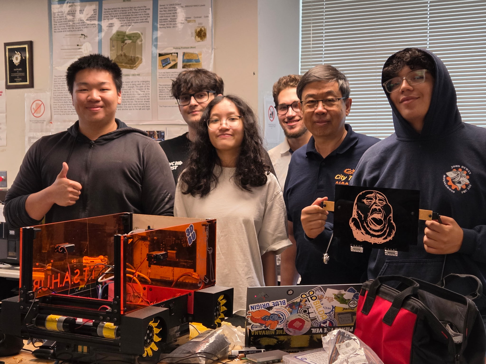
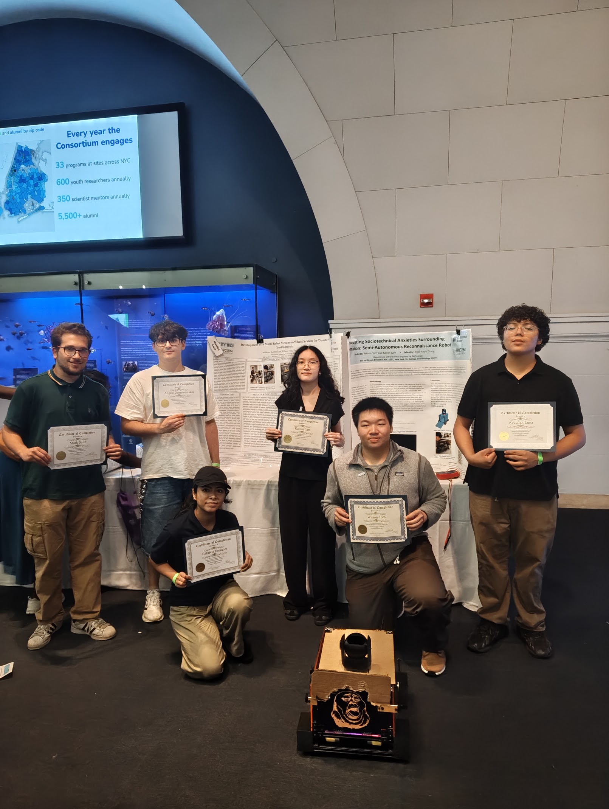

<div align="center">

# STEM Research Academy Robot Lab

### A six-week, full-system robotics program built around the 3TSahur mecanum robot

[](#overview)
[](#what-the-team-learned)
[](#robot-system)
[](robot/3TSahur/)

<strong>Quick navigation:</strong><br>
[Overview](#overview) | [Install](#install-on-the-robot) | [Learning](#what-the-team-learned) | [Project Gallery](#project-gallery) | [Robot System](#robot-system) | [Repository Contents](#repository-contents) | [Connect and Drive](#connect-and-drive) | [Back to Club](../)

</div>

---

<table>
  <tr>
    <td align="center" width="50%">
      <a href="images/final-robot.jpg">
        
      </a><br>
      <strong>3TSahur Robot</strong>
      <p>The completed mecanum robot brings together the custom chassis, ramp, USB camera, and Raspberry Pi control system.</p>
    </td>
    <td align="center" width="50%">
      <a href="images/group-photo-02.jpg">
        
      </a><br>
      <strong>The Team and Build</strong>
      <p>The team with the robot's enclosure open, showing the component placement and wiring behind the finished build.</p>
    </td>
  </tr>
</table>

## Overview

The STEM Research Academy Robot Lab was a six-week program for **two high school students** supported by **four collegiate mentors**. Instead of assembling a pre-made kit, the team worked through the complete engineering process: CAD, fabrication, electrical power, custom PCB work, motors, servos, camera integration, networking, and Python software.

The main result was **3TSahur**, a Raspberry Pi 4 robot with a four-wheel mecanum drivetrain, two-servo ramp, USB camera, standalone Wi-Fi network, and browser-based driving dashboard. It is a larger and more integrated system than the club's introductory robots.

| Program | Details |
| --- | --- |
| Duration | Six weeks |
| Team | 2 student researchers and 4 mentors |
| Main platform | Custom Raspberry Pi 4 mecanum robot |
| Mechanical work | CAD/CAM, 3D printing, bandsaw work, drilling, manual milling, and CNC preparation |
| Electrical work | 5 V logic, 12 V motor power, fused distribution, buck regulation, custom PCBs, motors, servos, camera, and status-light interfaces |
| Software | [MotionModule](https://github.com/AloeVeraZ/MotionModule) runtime and Driver Station, over-the-air code deploys and updates, camera stream, and safety watchdog |

> [!NOTE]
> The program also produced two smaller ESP32-S3 and ESP32-CAM experimental robots that create their own local Wi-Fi networks. Their source files are not included in this repository.

## Install on the robot

One command sets up the whole robot: the [MotionModule](https://github.com/AloeVeraZ/MotionModule) runtime and Driver Station, the 3TSahur robot project, ramp-servo timing, and camera support. Everything happens over SSH, so the robot needs no monitor, keyboard, or mouse.

1. **Flash the SD card.** In Raspberry Pi Imager, choose Raspberry Pi OS. In its settings, enter a Wi-Fi network with internet access and turn on SSH.
2. **Power the Pi.** Raise the chassis so all four wheels spin freely. The Pi needs internet for the install, through that Wi-Fi network or an Ethernet cable.
3. **Connect over SSH** from a laptop on the same network. Use the username you set in Imager, and `3tsahur.local` instead if the robot was set up before:

   ```bash
   ssh pi@raspberrypi.local
   ```

4. **Run the installer** as the normal user, not with `sudo`:

   ```bash
   curl -fsSL https://raw.githubusercontent.com/AloeVeraZ/CityTechClubProjects/main/stem-research-academy/installer/curl-install.sh | bash
   ```

5. **Wait for the reboot.** MotionModule tests itself before switching over, so the install takes a while. The Pi restarts on its own when it finishes.
6. **Open the dashboard** at `http://3tsahur.local`. If the Pi cannot find a saved Wi-Fi network, it starts the `3TSahur-Swarm` hotspot (password `roboswarm1`) after 30 seconds; join it and open `http://10.42.0.1`.
7. **Check every direction with the wheels raised** before driving on the floor. The checklist is in [`docs/SETUP.md`](docs/SETUP.md#04--validate-without-floor-driving).

| The installer | Result |
| --- | --- |
| Removes the original server | Old dashboard, always-on hotspot service, kiosk window, and `~/STEMResearchAcademy` |
| Installs `pigpiod` | Steady pulses for the two ramp servos on GPIO12 and GPIO18 |
| Installs camera packages | The Logitech USB camera streams in the Driver Station |
| Keeps GPIO18 free | MotionModule's IMU bus is turned off; 3TSahur has no IMU and uses GPIO18 for ramp servo 2 |
| Adds the robot project | `robot/3TSahur` becomes `~/MotionModule/robots/3TSahur`, the active robot |
| Installs MotionModule | Tests the release, names the Pi `3tsahur`, starts the dashboard, and reboots |

Running the same command again is safe. It keeps the previous robot folder under `~/MotionModule/backups`.

| Later change | How |
| --- | --- |
| Edit robot code from a laptop | Dashboard → **Code** → choose the `3TSahur` folder → **Deploy and run** |
| Update MotionModule | Dashboard → **Update** |
| Take the robot folder from GitHub | Run the install command ending in `bash -s -- --robot-only` |
| Install without the final reboot | Run the install command ending in `bash -s -- --no-reboot` |

More detail is in the [installer README](installer/README.md).

## What the team learned

| Stage | Skills |
| --- | --- |
| 01 · Design | Parametric CAD, assembly clearances, component placement, and engineering drawings. |
| 02 · Prototype | 3D-printing tolerances, material choices, fit checks, and rapid revision. |
| 03 · Fabricate | Safe use of mills, bandsaws, drill presses, tapping tools, and power tools. |
| 04 · Wire | Soldering, harness routing, common grounding, fused power, buck converters, and custom PCBs. |
| 05 · Integrate | H-bridge drivers, mecanum motors, ramp servos, USB video, and status modules. |
| 06 · Program | Python services, Linux systemd, local networking, camera streaming, web controls, and safety timeouts. |

This project connects the club's foundational work to more advanced automation. The camera, network, motor-control, actuator, and software layers create the kind of complete platform that can later support computer vision and autonomous behavior.

## Project gallery

<table>
  <tr>
    <td align="center" width="50%">
      <a href="images/group-photo-01.png">
        
      </a><br>
      <strong>Research Presentation</strong>
      <p>The team presenting its robotics research with project posters, completion certificates, and the robot.</p>
    </td>
    <td align="center" width="50%">
      <a href="images/final-robot.jpg">
        
      </a><br>
      <strong>Completed Robot</strong>
      <p>The completed 3TSahur robot, including its mecanum drivetrain, ramp, camera, and Raspberry Pi control system.</p>
    </td>
  </tr>
</table>

## Robot system

| Subsystem | Implementation |
| --- | --- |
| Drive | Four independently controlled mecanum wheels for forward, reverse, strafe, and rotation |
| Controller | Raspberry Pi 4 running Raspberry Pi OS |
| Motor output | Two H-bridge drivers controlled through BCM GPIO PWM |
| Auxiliary motion | Two mirrored ramp servos driven through `pigpio` |
| Vision | Automatically detected Logitech USB camera with MJPEG streaming |
| Interface | MotionModule Driver Station: keyboard, game controller or phone touch sticks, camera view, ramp controls |
| Networking | Saved Wi-Fi, with a `3TSahur-Swarm` hotspot fallback |
| Safety | 300 ms motor watchdog, reversal deadtime, page-hidden stop, STOP and E-stop |

The robot runs on [MotionModule](https://github.com/AloeVeraZ/MotionModule), the club's Raspberry Pi robot runtime, with 3TSahur's own wiring kept exactly as built. Browser commands go to the Raspberry Pi, which mixes mecanum-wheel outputs, controls the ramp servos, and streams the camera back to the Driver Station. Driving needs no internet connection; code changes and updates happen over Wi-Fi from the dashboard, with no monitor, keyboard, or mouse on the robot.

## Repository contents

```text
stem-research-academy/
|-- images/         # Club, team, and completed-robot photos
|-- robot/3TSahur/  # MotionModule robot project: drive, pins, ramp, Driver Station
|-- installer/      # One-command Raspberry Pi install on MotionModule
|-- docs/           # Wiring, setup, and ramp-actuator references
|-- tests/          # Hardware-independent safety and behavior tests
`-- README.md
```

| Area | Start here |
| --- | --- |
| Robot software | [`robot/3TSahur/`](robot/3TSahur/) |
| Raspberry Pi installation | [`installer/README.md`](installer/README.md) |
| Wiring and GPIO | [`docs/WIRING.md`](docs/WIRING.md) |
| Ramp servos | [`docs/3TSAHUR_AUXILIARY_ACTUATORS.md`](docs/3TSAHUR_AUXILIARY_ACTUATORS.md) |
| Bench setup | [`docs/SETUP.md`](docs/SETUP.md) |
| Automated checks | [`tests/`](tests/) |

Run the hardware-independent tests with:

```bash
python -m unittest discover -s tests -v
```

The MotionModule integration tests run when MotionModule is installed (`pip install -e` a MotionModule checkout) and are skipped otherwise.

## Connect and drive

| Setting | Default |
| --- | --- |
| Dashboard | `http://3tsahur.local` |
| Fallback hotspot | `3TSahur-Swarm`, password `roboswarm1`, after 30 s without saved Wi-Fi |
| Dashboard on the hotspot | `http://10.42.0.1` |

Open the dashboard, then **Open Driver Station**, tick the safety box and press **Enable**.

| Key | Action |
| --- | --- |
| `W` / `S` | Drive forward / backward |
| `A` / `D` | Strafe left / right |
| `Q` / `E` | Rotate left / right |
| `R` | Open or close the ramp |
| `Space` | Stop and disable |

A game controller (left stick drives and strafes, right stick turns, `Y` toggles the ramp) and phone touch sticks work too.

Change Wi-Fi networks or the hotspot from Dashboard → **Debug → Network**. Change the default hotspot password before a public deployment.

## Safety

> [!CAUTION]
> Raise the chassis so all four wheels can spin freely during the first test. Keep the 12 V motor supply separate from the Raspberry Pi 5 V logic rail, verify a common ground, and set the servo buck converter to 5.0 V before connecting the servos.

Confirm that closing the browser, losing Wi-Fi, pressing `Space` or **STOP ALL OUTPUTS**, and letting the 300 ms watchdog expire all stop the drivetrain.

---

[Back to the City Tech AI & Automation Club](../)
